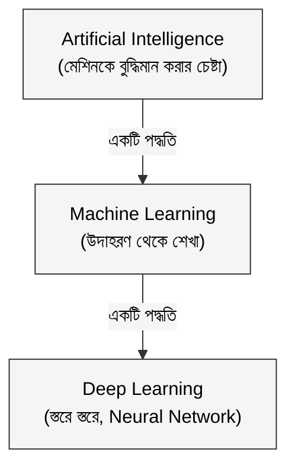

ফারহান CSE-তে ভর্তি হওয়ার পর থেকে একটা কথা সবাই বলে: "AI শিখতে হবে, AI ছাড়া চাকরি নেই।"

কিন্তু ফারহান কখনো সরাসরি জিজ্ঞেস করতে পারেনি: AI আসলে কী?

সে জানে Terminator AI, সে জানে ChatGPT AI। কিন্তু এই দুটো কি একই জিনিস? Daraz যখন ঠিক তার পছন্দের জুতোর ad দেখায়, সেটাও কি AI? Google Photos যখন তার মা-বাবার ছবি আলাদা করে রাখে নাম না জেনেই, সেটা?

একদিন সে তার বড় ভাইকে জিজ্ঞেস করল।

বড় ভাই বললেন: "বোস। চা খা। গল্প বলি।"

---

## ১. বুদ্ধিমত্তা মানে কী?

AI বোঝার আগে একটু ভাবতে হবে: **intelligence** বা বুদ্ধিমত্তা আসলে কী?

ধরো ফারহান রাস্তায় একটা নতুন দোকান দেখল। সে কখনো সেই দোকানে যায়নি। কিন্তু সাইনবোর্ড পড়ে, পরিবেশ দেখে, আর আগের অভিজ্ঞতা থেকে সে বুঝে নিল, "এটা মনে হয় ভালো বিরিয়ানির দোকান।" সে ঢুকল, খেল, আর সিদ্ধান্ত নিল।

এই পুরো প্রক্রিয়াটা হলো intelligence:

পরিবেশ থেকে তথ্য নেওয়া, সেই তথ্য বিশ্লেষণ করা, এবং সিদ্ধান্ত নেওয়া।

মানুষ এটা করে জন্মের পর থেকে হাজারো অভিজ্ঞতার মধ্য দিয়ে। আর **Artificial Intelligence** হলো machine-কে এই একই কাজ করতে শেখানোর চেষ্টা।

মানুষের intelligence আছে স্বাভাবিকভাবে। Machine-কে সেটা দিতে হয় তৈরি করে। তাই নাম **Artificial** Intelligence।

---

## ২. AI কীভাবে কাজ করে? তিনটা যুগ

AI-র ইতিহাসে মূলত তিনটা পদ্ধতি এসেছে। ফারহানের বড় ভাই তিনটা উদাহরণ দিলেন।

**পদ্ধতি ১: নিয়ম লিখে দাও (Rule-based AI)**

প্রথম দিকের AI ছিল সহজ: মানুষ নিজেই নিয়ম লিখে দিত।

"যদি ইমেইলে 'বিনামূল্যে পুরস্কার' লেখা থাকে, তাহলে spam।"
"যদি তাপমাত্রা ৩৮ ডিগ্রির বেশি হয়, তাহলে জ্বর।"

এটা কাজ করত ঠিকই, কিন্তু সমস্যা হলো: দুনিয়া অনেক জটিল। প্রতিটা পরিস্থিতির জন্য আলাদা নিয়ম লেখা সম্ভব না।

**পদ্ধতি ২: উদাহরণ থেকে শেখো (Machine Learning)**

তারপর এলো **Machine Learning**। এখানে নিয়ম মানুষ লেখে না, machine নিজেই উদাহরণ দেখে দেখে শেখে।

হাজারটা spam ইমেইল দেখাও, হাজারটা ভালো ইমেইল দেখাও। Machine নিজেই বুঝে নেবে পার্থক্য কোথায়।

ফারহান বলল, "ঠিক যেভাবে বাচ্চারা শেখে। বিড়াল দেখিয়ে বলো 'এটা বিড়াল', কুকুর দেখিয়ে বলো 'এটা কুকুর', বাচ্চা নিজেই নিয়মটা মাথায় ঢুকিয়ে নেয়।"

"একদম ঠিক," বললেন বড় ভাই।

**পদ্ধতি ৩: স্তরে স্তরে শেখো (Deep Learning)**

সবচেয়ে আধুনিক পদ্ধতি হলো **Deep Learning**। এখানে machine মানুষের মস্তিষ্কের অনুকরণে অনেক স্তরে স্তরে শেখে।

তুমি যখন একটা মুখ দেখো, প্রথমে রেখা বোঝো, তারপর চোখ-নাক, তারপর মুখের ভাব, তারপর চেনো। এই স্তরগুলোকে machine-এ বানানো হলো Neural Network হিসেবে। অনেকগুলো স্তর মিলে Deep Neural Network, আর সেখান থেকে নামটা এলো Deep Learning।

এই তিনটা circle-in-circle সম্পর্ক। Deep Learning হলো Machine Learning-এর একটা ধরন, আর Machine Learning হলো AI-র একটা ধরন।

---

## ৩. AI, ML, DL — এই তিনটা কি একই জিনিস?

এটাই সবচেয়ে বড় confusion। ফারহানও প্রথমে এটা নিয়েই গোলমাল করত।

সহজ করে বলি। কল্পনা করো তিনটা বৃত্ত, একটার ভেতরে আরেকটা।

**AI** হলো সবচেয়ে বড় বৃত্ত। লক্ষ্য একটাই: machine-কে বুদ্ধিমান করো।

**Machine Learning** হলো AI অর্জনের একটা পথ। বলছে: নিয়ম হাতে লেখার বদলে, data দিয়ে machine-কে শিখতে দাও।

**Deep Learning** হলো Machine Learning-এর একটা বিশেষ পদ্ধতি। বলছে: অনেক স্তরের Neural Network দিয়ে শেখাও। ছবি, কথা, লেখা বোঝার জন্য এটাই সবচেয়ে শক্তিশালী।

ChatGPT, Google Photos-এর face recognition, Shazam-এর গান চেনা, এগুলো সবই Deep Learning।

কিন্তু সব AI, Deep Learning না। বিদ্যুৎ বিলের হিসেব করা, codeর bug ধরা, সহজ recommendation, এগুলো traditional Machine Learning দিয়েও হয়।

---

## ৪. বাংলাদেশে AI এখন কোথায়?

ফারহান জিজ্ঞেস করল, "ভাই, AI কি শুধু Silicon Valley-র ব্যাপার? আমাদের দেশে?"

বড় ভাই হাসলেন।

"তোর ফোনে Daraz খোল।"

ফারহান খুলল। বড় ভাই বললেন: "তুই গতকাল স্পোর্টস জুতো দেখেছিলি। আজ দেখ home page-এ কী আসছে।"

জুতোর ad। একদম সেই ধরনের।

"এটা AI। তোর browsing pattern দেখে recommendation করছে।"

"bKash যখন unusual transaction detect করে fraud হিসেবে, সেটা AI। Grameenphone যখন তোকে নির্দিষ্ট offer পাঠায়, তোর usage pattern দেখে, সেটাও। Shohoz Food যখন তোর area-র popular items দেখায়, সেটাও।"

AI দূরে নেই। তুমি প্রতিদিন এটা ব্যবহার করছ, বুঝতে পারছ না।

---

## ৫. AI কি সত্যিই "বোঝে"?

ফারহান একটু চিন্তিত হলো। "ভাই, AI কি সত্যিই বুঝতে পারে? নাকি শুধু pattern মেলায়?"

এটা দারুণ প্রশ্ন।

বর্তমানের AI, যেটা আমরা ব্যবহার করি, সেটা মূলত **pattern recognition**। অনেক data দেখে, সে pattern খোঁজে, আর সেই pattern অনুযায়ী output দেয়।

ChatGPT বাংলা লিখতে পারে কারণ সে কোটি কোটি বাংলা বাক্য পড়েছে এবং কোন শব্দের পর কোন শব্দ আসে সেটার pattern শিখেছে। সে "বোঝে" না, সে অনুমান করে, অসাধারণ দক্ষতায়।

এই AI-কে বলে **Narrow AI**: নির্দিষ্ট কাজে অসাধারণ, কিন্তু সেই কাজের বাইরে অচল।

আর যে AI সব কিছু বুঝবে, মানুষের মতো reasoning করবে, সেটাকে বলে **General AI**। সেটা এখনো কল্পনা।

---

## সারসংক্ষেপ

| প্রশ্ন | উত্তর |
|---|---|
| AI কী? | Machine-কে বুদ্ধিমান করার বিজ্ঞান ও প্রকৌশল |
| ML কী? | AI-র একটা পদ্ধতি: data থেকে নিজে নিজে শেখা |
| Deep Learning কী? | ML-র একটা শক্তিশালী পদ্ধতি: Neural Network দিয়ে |
| AI কি "বোঝে"? | না, এটা অত্যন্ত দক্ষ pattern matching |
| Narrow AI কী? | নির্দিষ্ট কাজে expert AI, এখন যা আছে |
| General AI কী? | সব বিষয়ে মানুষের মতো AI — এখনো কল্পনা |

**মূল শিক্ষা:**

**AI মানে রোবট না, জাদু না।** এটা data থেকে শেখার গাণিতিক পদ্ধতি।

**AI, ML, আর Deep Learning এক জিনিস না।** এগুলো একটার ভেতরে আরেকটা, ছোট হতে হতে আরো শক্তিশালী।

**বর্তমানের AI "বোঝে" না, pattern চেনে।** এই পার্থক্যটা মাথায় রাখলে অনেক ভুল ধারণা কেটে যাবে।

**AI দূরে নেই, তুমি প্রতিদিন এটা ব্যবহার করছ।** Daraz, bKash, Google Photos, সবখানেই।

> পরবর্তী পর্বে দেখব: machine আসলে কীভাবে "শেখে"? Data দিলেই কি শিখে ফেলে, নাকি পেছনে আরো কিছু আছে? সেই ধারণার নাম **Machine Learning।**

*AI Fundamentals সিরিজের পরবর্তী পর্ব: Machine Learning — উদাহরণ থেকে শেখার বিজ্ঞান*
