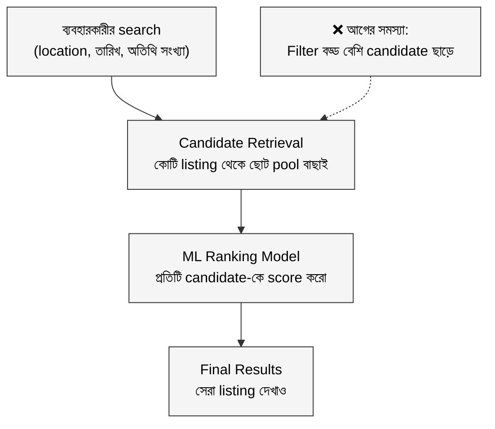
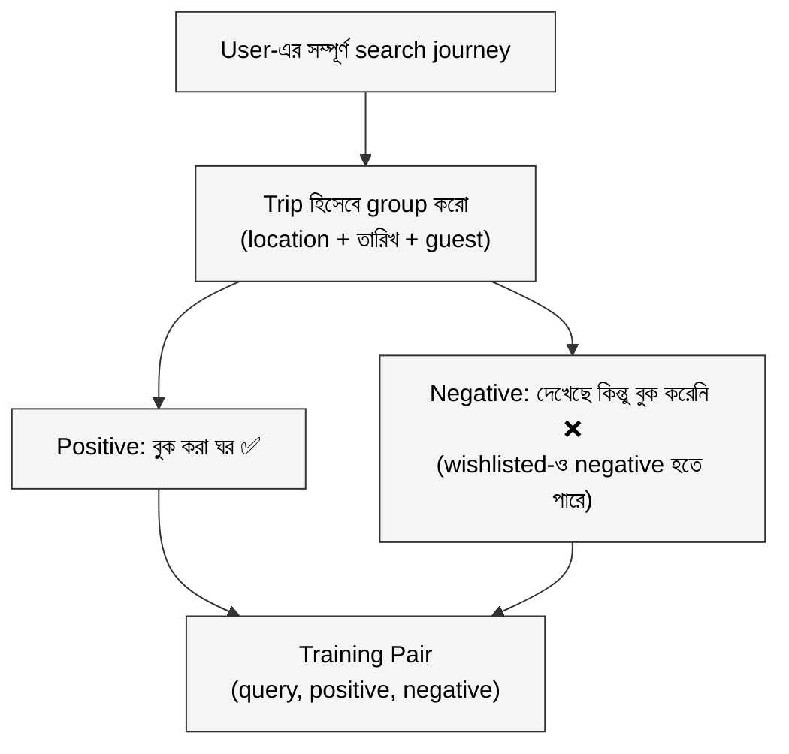
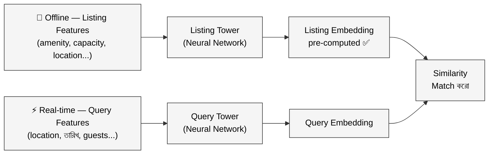
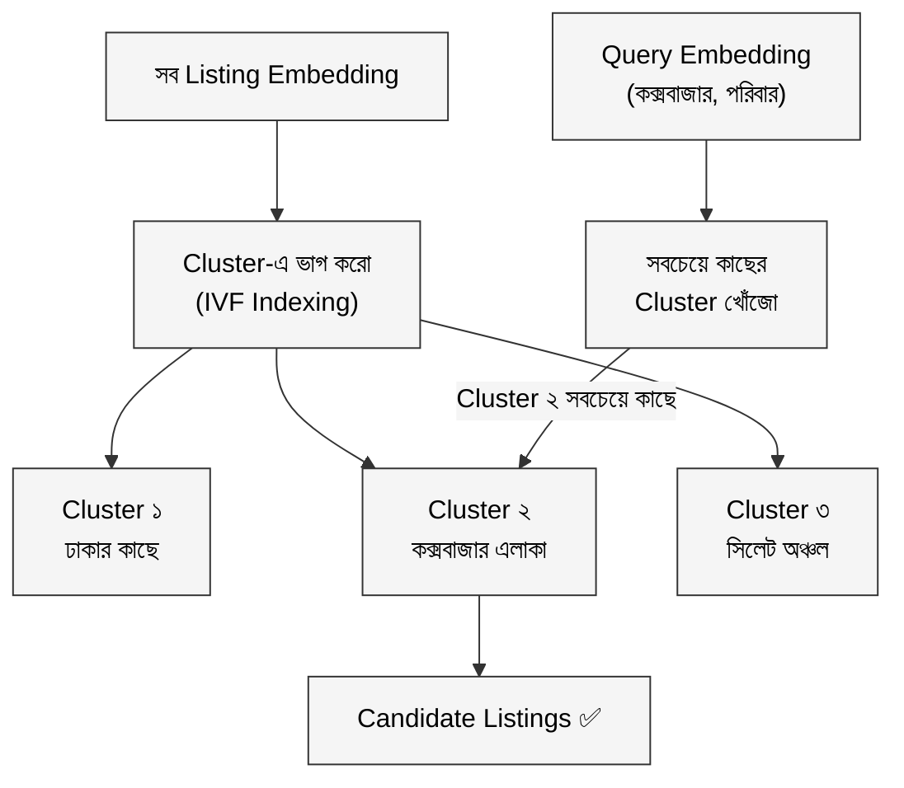

ঈদের আগের রাত। নাবিলা ল্যাপটপ খুলে বসেছে। পরিবারের সবাই মিলে কক্সবাজার যাওয়ার পরিকল্পনা চলছে — বাবা-মা, ছোট ভাই, দাদু। পাঁচজনের জন্য একটা বড় ঘর চাই, সমুদ্রের কাছাকাছি, কিন্তু বাজেটের মধ্যে।

সে GoZayaan খুলল। লিখল: "কক্সবাজার"।

ফলাফল এলো: ৮,৪০০টি জায়গা।

নাবিলা একটু চিন্তায় পড়ল। আট হাজারের বেশি অপশন। কোনটা আগে দেখাবে? কোনটা আসলে তার পরিবারের জন্য সেরা? আর অ্যাপটা কি সেটা বুঝতে পারে?

এই প্রশ্নের উত্তর খুঁজতে গিয়েই Airbnb তাদের engineering ইতিহাসের অন্যতম বড় সমস্যায় পড়েছিল। শুধু কক্সবাজার না — Paris, London, বা California লিখলে লক্ষাধিক listing। সব দেখানো সম্ভব না, সব র‍্যাঙ্ক করা লেটেন্সির দিক থেকে অসম্ভব। তাহলে উপায়?

এই সমস্যার সমাধানের নাম **Embedding-Based Retrieval**, সংক্ষেপে **EBR**।

---

## ১. সমস্যাটা আসলে কতটা কঠিন?

Airbnb-র search system কয়েকটা ধাপে কাজ করে। প্রথমে বিশাল listing pool থেকে কিছু candidate বাছাই করতে হয়। তারপর সেই ছোট্ট pool-টার উপর ভারী ML model চালানো হয় — যেটা প্রতিটা listing-কে score করে, সেরাগুলো উপরে আনে।

সমস্যা হলো প্রথম ধাপে: candidate বাছাই।

আগের পদ্ধতিতে এই বাছাইটা হতো সরল নিয়মে — location filter, date filter, guest count filter। নাবিলা "কক্সবাজার, ৫ জন, ১৫ মে থেকে ১৮ মে" দিলে, এই তিনটা criteria মেলে এমন সব listing ঢুকে যেত candidate pool-এ। তারপর সেই হাজার হাজার listing-কে score করতে গিয়ে সিস্টেম হাঁপিয়ে যেত।

আরো বড় সমস্যা হলো Airbnb-র নতুন feature: **flexible date search** — যেখানে কোনো নির্দিষ্ট তারিখ ছাড়াই search করা যায়। তখন candidate pool আরো বিশাল হয়ে যায়।

Airbnb-র engineering team বুঝল, traditional filter দিয়ে এই candidate selection ঠিকমতো হচ্ছে না। কারণ filter জানে না নাবিলার আসল পছন্দ কী — সমুদ্র view চাই, রান্নাঘর দরকার, নাকি পুলটা important। Filter শুধু rule মানে, context বোঝে না।

দরকার এমন একটা system যেটা query-র **মানে** বুঝবে, শুধু শব্দ মেলাবে না।

---

## ২. Embedding: সংখ্যা দিয়ে মানে বোঝানো

নাবিলার কথায় ফিরে আসি। সে যখন "কক্সবাজার সমুদ্রের কাছে পরিবার সহ" লেখে, তখন এই পুরো ব্যাপারটার একটা "অর্থ" আছে। আর একটা ঘরেরও "অর্থ" আছে — সেটা সমুদ্রের কাছে কিনা, বড় পরিবারের জন্য উপযুক্ত কিনা, কোন amenity আছে।

EBR-এর মূল ধারণাটা এখানেই: এই দুটো "অর্থ"কে সংখ্যার ভাষায় রূপান্তর করো। তারপর দেখো কোন ঘরগুলোর সংখ্যা-প্রতিনিধিত্ব নাবিলার search-এর সবচেয়ে কাছাকাছি।

এই সংখ্যার ভাষাকে বলে **Embedding** — একটা vector, মানে অনেকগুলো সংখ্যার সারি। যেমন:

- নাবিলার search → `[0.82, 0.15, 0.67, 0.44, ...]`
- সমুদ্র-পাশের একটা বড় ঘর → `[0.79, 0.18, 0.71, 0.41, ...]`
- শহরের মাঝে একটা ছোট স্টুডিও → `[0.12, 0.91, 0.23, 0.88, ...]`

প্রথম ঘরটার সংখ্যাগুলো নাবিলার search-এর কাছাকাছি। দ্বিতীয়টা অনেক দূরে। তাই প্রথমটা candidate হিসেবে আসবে, দ্বিতীয়টা বাদ পড়বে।

কিন্তু এই embedding কীভাবে তৈরি হয়? এখানেই আসে ML model-এর কাজ।

---

## ৩. Model শেখানো: ভালো-খারাপ জোড়া বানাও

এটা একটু চিন্তা করো। নতুন একজন sales representative-কে train করার সময় তুমি কী করবে? তাকে বলবে, "এই customer-এর জন্য এই product সেরা, এই product না।" উদাহরণ দিয়ে দিয়ে শেখাবে।

Airbnb ঠিক এটাই করেছে। তারা একটা training data pipeline বানিয়েছে যেটার নাম **Contrastive Learning** — মানে তুলনামূলক শিক্ষা।

ধাপগুলো এরকম:

**ধাপ ১:** ঐতিহাসিক booking data নাও। যেসব user আসলে book করেছে, তাদের পুরো journey দেখো।

**ধাপ ২:** প্রতিটা user-এর journey-কে একটা "trip" হিসেবে ভাবো — location, তারিখ, guest count মিলিয়ে একই trip-এর সব search একসাথে রাখো।

**ধাপ ৩:** সেই trip-এ user যে ঘরটা শেষমেশ book করেছে — সেটা **positive label**। আর যেসব ঘর search result-এ দেখেছে কিন্তু book করেনি — সেগুলো **negative label**।

চালাকিটা হলো negative selection-এ। Random ঘর negative হিসেবে নিলে model খুব সহজেই শিখে ফেলত — পার্থক্য তখন বড্ড obvious। কিন্তু যেসব ঘর user দেখেছে, ক্লিক করেছে, এমনকি wishlist-এও রেখেছে কিন্তু তবুও book করেনি — সেগুলোকে negative বানালে model সত্যিকারের কঠিন পার্থক্য শিখতে পারে।

Model এই pair দেখে শেখে: query আর positive-এর embedding কাছাকাছি রাখো, query আর negative-এর embedding দূরে সরাও।

---

## ৪. Two-Tower Architecture: দুই দিক থেকে একসাথে ভাবো

Model architecture-টা বেশ মজার। Airbnb এখানে একটা **Two-Tower Network** ব্যবহার করেছে — মানে দুটো আলাদা neural network যেগুলো একসাথে train হয়।

**Listing Tower:** প্রতিটা ঘরের জন্য embedding বানায়। ইনপুট হিসেবে নেয় ঘরের feature — কতজন থাকতে পারে, কী কী amenity আছে, ঐতিহাসিক booking rate কেমন, কোন এলাকায় আছে।

**Query Tower:** প্রতিটা search-এর জন্য embedding বানায়। ইনপুট হিসেবে নেয় search-এর feature — location, তারিখ, কতজন, flexible dates কিনা।

এখন সবচেয়ে চালাক সিদ্ধান্তটা: Listing Tower-এর কাজ প্রতিদিন একবার offline-এ করে রাখা হয়। Airbnb-তে কোটি listing আছে, কিন্তু প্রতিদিনের শুরুতে একবার সব listing-এর embedding pre-compute করে রাখলেই হলো।

User যখন search করছে, তখন শুধু Query Tower real-time চালাতে হচ্ছে। এতে **latency** অনেক কমে যায়।

---

## ৫. কোটি ঘরে খোঁজা: IVF দিয়ে দ্রুত ANN

এখন আরেকটা সমস্যা। Listing embedding pre-compute করা আছে — ঠিক আছে। কিন্তু query embedding পেলে কোটি listing-এর সাথে এক এক করে distance calculate করলে অনেক সময় লাগবে।

এখানে দরকার **Approximate Nearest Neighbor (ANN)** — মানে exact সেরাটা না খুঁজে, দ্রুত প্রায় সেরাটা খোঁজা।

Airbnb দুটো approach পরীক্ষা করেছিল:

**HNSW (Hierarchical Navigable Small Worlds):** Graph-based structure। recall একটু বেশি ছিল — মানে সঠিক ঘরগুলো বেশি মিস হতো না। কিন্তু সমস্যা হলো Airbnb-তে listing-এর pricing আর availability প্রতিদিন বহুবার update হয়। HNSW-র memory অনেক বেড়ে গেছিল। তাছাড়া, Airbnb search-এ geographic filter সবসময় থাকে — HNSW-র সাথে এই filtering মিলিয়ে চালালে latency খারাপ হয়ে যাচ্ছিল।

**IVF (Inverted File Index):** Listing-গুলোকে আগে থেকেই cluster-এ ভাগ করে রাখো। Search-এর সময় query embedding-এর সবচেয়ে কাছের cluster-গুলো থেকেই খোঁজো — পুরো database scan করতে হয় না।

Airbnb শেষমেশ **IVF বেছে নিল** কারণ:
- Update করা সহজ। নতুন listing বা price change হলে শুধু cluster assignment update করলেই হয়।
- Geographic filter-এর সাথে মেলানো সহজ — cluster-কে একটা filter হিসেবেই treat করা যায়।
- Memory-তে শুধু cluster centroid আর assignment রাখতে হয়।

আরেকটা interesting insight: similarity measure হিসেবে **Euclidean distance** dot product-এর চেয়ে ভালো কাজ করেছিল IVF-এর ক্ষেত্রে। Dot product শুধু direction দেখে, magnitude দেখে না। কিন্তু Airbnb-র features-এর অনেকটাই historical count-based — যেখানে magnitude গুরুত্বপূর্ণ। Euclidean distance দিয়ে cluster size অনেক বেশি balanced হয়েছিল, ফলে retrieval quality ভালো থেকেছে।

---

## বাস্তব উদাহরণ: নাবিলার search আবার দেখি

এবার আবার নাবিলার কাছে ফিরি। সে লিখছে: "কক্সবাজার, ৫ জন, ১৫-১৮ মে, সমুদ্রের কাছে"

**ধাপ ১:** Query Tower real-time চলে। নাবিলার search-এর একটা embedding তৈরি হয়। ধরো: `[0.81, 0.14, 0.70, ...]`

**ধাপ ২:** IVF index-এ এই embedding-এর সবচেয়ে কাছের cluster খোঁজা হয়। "কক্সবাজার, বড় ঘর" cluster-এ যেসব listing আছে সেগুলো candidate হয়।

**ধাপ ৩:** এই ছোট্ট candidate pool — ধরো কয়েকশো listing — এখন ভারী ML ranking model-এ দেওয়া হয়। সেই model প্রতিটা listing-কে score করে। কোনটায় পরিবার বেশি থাকে? কোনটার review ভালো? নাবিলার মতো user আগে কোনটায় গেছে?

**ধাপ ৪:** সেরা ১০-২০টা result নাবিলার সামনে আসে। সবচেয়ে relevant, সবচেয়ে সম্ভাবনাময়।

Traditional filter যদি শুধু "কক্সবাজার, ৫ জন capable" দিয়ে candidate বাছাই করত, ৩,০০০ listing আসত। EBR দিয়ে সেটা নেমে আসে ৩০০-এ — আর সেগুলো আসলে নাবিলার পছন্দের কাছাকাছি।

---

## ফলাফল

Airbnb এই EBR system production-এ নামিয়েছে — শুধু Search-এ না, Email Marketing-এও। A/B test-এ statistically significant booking বেড়েছে। Airbnb-র engineering blog অনুযায়ী, এই retrieval improvement গত দুই বছরের সেরা ML improvement-গুলোর সমতুল।

সবচেয়ে বড় কারণ: আগে retrieval ধাপে query context ছিল না। EBR আনার পরে, ঘর বাছাইয়ের সময় থেকেই user কী চাইছে সেটা বোঝা যাচ্ছে।

---

## সারসংক্ষেপ

| গল্পের ভাষায় | প্রযুক্তির ভাষায় |
|---|---|
| নাবিলার search | Query |
| প্রতিটা ঘরের "মানে" | Listing Embedding |
| search-এর "মানে" | Query Embedding |
| ভালো-খারাপ উদাহরণ দিয়ে শেখানো | Contrastive Learning |
| দুই দিক থেকে embedding বানানো | Two-Tower Architecture |
| আগে থেকে ঘর cluster করে রাখা | IVF Index |
| দ্রুত কাছের ঘর খোঁজা | Approximate Nearest Neighbor (ANN) |
| ভারী model চালানোর আগে ছাঁকা | Candidate Retrieval |

**মূল শিক্ষা:**

**ML ranking তখনই ভালো কাজ করে যখন শুরুতে সঠিক candidate আসে।** Retrieval ধাপটা যতটা গুরুত্বপূর্ণ, ততটা আলোচনা হয় না।

**Hard negative তৈরি করাটা training-এর সবচেয়ে কঠিন আর গুরুত্বপূর্ণ অংশ।** Random negative দিয়ে model কখনো ভালো শেখে না।

**Offline pre-computation latency বাঁচায়।** Listing embedding দিনে একবার বানিয়ে রাখলে real-time-এ শুধু query process করলেই চলে।

**Theoretical best আর production best সবসময় এক না।** HNSW recall-এ ভালো হলেও IVF production-এর real constraints-এ জিতেছে।

---

**মূল উৎস:** [Embedding-based retrieval for Airbnb search — Airbnb Engineering Blog](https://medium.com/airbnb-engineering/embedding-based-retrieval-for-airbnb-search-aabebfc85839)
