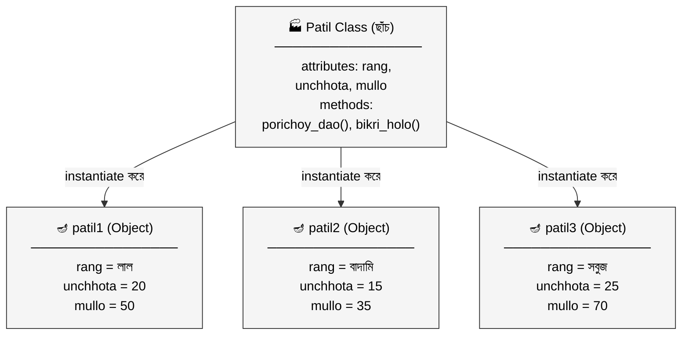
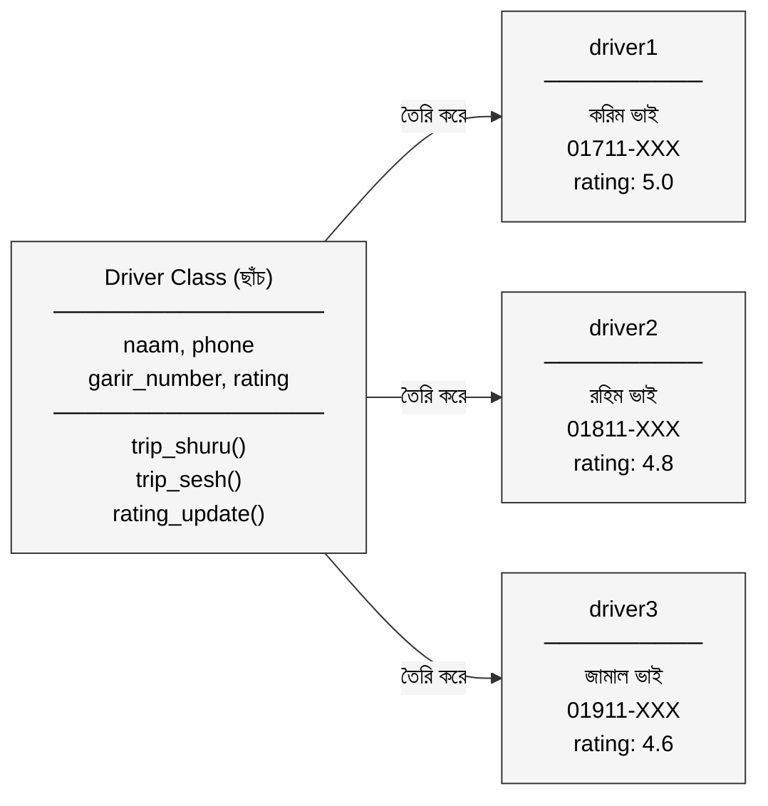

# ক্লাস আর অবজেক্ট: একটা ছাঁচ, হাজার পাতিল
## LLD (Low Level Design) সিরিজ

---

নারায়ণগঞ্জের বাজারে করিম মিয়ার একটা ছোট্ট কারখানা আছে।

মাটির পাতিল বানান তিনি। বছরের পর বছর ধরে।

কারখানার কোণে একটা পুরনো কাঠের ছাঁচ আছে। সেই ছাঁচটাই সব। ছাঁচটা বলে দেয় — পাতিলের মুখ কতটা চওড়া হবে, পেট কতটা গোলাকার হবে, তলা কতটা পুরু হবে। ছাঁচটা নিজে পাতিল না। কিন্তু ছাঁচ ছাড়া একটা পাতিলও তৈরি হয় না।

করিম মিয়া প্রতিদিন সেই এক ছাঁচ দিয়ে অনেক পাতিল বানান। একটা পাতিলে তিনি লাল রঙ দেন, একটায় বাদামি। একটা ছোট, একটা বড়। একটা যায় রান্নাঘরে, একটা যায় ফুলের টব হয়ে বারান্দায়।

প্রতিটা পাতিল আলাদা। কিন্তু সবাই একই ছাঁচ থেকে জন্মেছে।

এই ছাঁচটাই হলো **Class**। আর প্রতিটা পাতিল হলো একটা করে **Object**।

---

## ১. Class কী?

করিম মিয়ার ছাঁচটা একটু ভালো করে দেখো।

ছাঁচটায় লেখা আছে — পাতিলের কী কী বৈশিষ্ট্য থাকবে। রঙ থাকবে। উচ্চতা থাকবে। দাম থাকবে। আর কী কী করতে পারবে — পানি ধরে রাখতে পারবে, বিক্রি হতে পারবে।

প্রোগ্রামিং-এ **Class** ঠিক এই কাজটাই করে। এটা একটা blueprint বা ছাঁচ — যেটা বলে দেয় কোনো একটা জিনিসের কী কী data থাকবে (এগুলোকে বলে **attributes** বা **fields**) আর সেটা কী কী কাজ করতে পারবে (এগুলোকে বলে **methods**)।

Class নিজে কোনো real জিনিস না। এটা শুধু একটা নকশা। করিম মিয়ার ছাঁচ যেমন নিজে পাতিল না, Class-ও তেমনি নিজে কোনো concrete জিনিস না।

```python
class Patil:
    def __init__(self, rang, unchhota, mullo):
        self.rang = rang          # রঙ
        self.unchhota = unchhota  # উচ্চতা (সেমি)
        self.mullo = mullo        # দাম (টাকা)

    def porichoy_dao(self):
        print(f"রঙ: {self.rang}, উচ্চতা: {self.unchhota} সেমি, দাম: {self.mullo} টাকা")

    def bikri_holo(self):
        print(f"{self.rang} রঙের পাতিলটা বিক্রি হয়ে গেছে!")
```

এখানে `Patil` হলো Class। `rang`, `unchhota`, `mullo` হলো attributes — পাতিলের বৈশিষ্ট্য। `porichoy_dao()` আর `bikri_holo()` হলো methods — পাতিল কী কী করতে পারে।

কিন্তু এখনো কোনো পাতিল তৈরি হয়নি। শুধু ছাঁচটা বানানো হয়েছে। এখন দরকার আসল পাতিল।

---

## ২. Object কী?

করিম মিয়া সকালে ছাঁচ নিয়ে বসলেন। প্রথম পাতিলে লাল রঙ দিলেন, উচ্চতা ২০ সেমি, দাম ৫০ টাকা। দ্বিতীয় পাতিলে বাদামি রঙ, উচ্চতা ১৫ সেমি, দাম ৩৫ টাকা।

দুটো পাতিল। একই ছাঁচ। কিন্তু দুটো সম্পূর্ণ আলাদা।

প্রোগ্রামিং-এ এই প্রতিটা পাতিলই একটা **Object** বা **Instance**। Class থেকে object তৈরি করার কাজটাকে বলে **Instantiation**।

```python
# দুটো Object তৈরি হলো একই Class থেকে
patil1 = Patil("লাল", 20, 50)
patil2 = Patil("বাদামি", 15, 35)

patil1.porichoy_dao()
# → রঙ: লাল, উচ্চতা: 20 সেমি, দাম: 50 টাকা

patil2.porichoy_dao()
# → রঙ: বাদামি, উচ্চতা: 15 সেমি, দাম: 35 টাকা

patil1.bikri_holo()
# → লাল রঙের পাতিলটা বিক্রি হয়ে গেছে!
```

`patil1` আর `patil2` দুটো আলাদা object। একটার রঙ বদলালে অন্যটা প্রভাবিত হয় না। প্রতিটার নিজস্ব data আছে, নিজস্ব অস্তিত্ব আছে।



একটা Class থেকে যত খুশি Object তৈরি করা যায়। করিম মিয়ার ছাঁচ দিয়ে যেমন হাজার পাতিল বানানো যায়।

---

## ৩. Attributes এবং Methods — পাতিলের পরিচয়

প্রতিটা পাতিলের দুটো দিক আছে।

একটা হলো সে কে — তার রঙ কী, উচ্চতা কত, দাম কত। এগুলো তার পরিচয়। প্রোগ্রামিং-এ এগুলোকে বলে **attributes** বা **instance variables**। প্রতিটা object-এর attributes-এর মান আলাদা আলাদা হতে পারে।

আরেকটা হলো সে কী করতে পারে — পানি ধরতে পারে, বিক্রি হতে পারে, ভাঙতে পারে। এগুলো তার ক্ষমতা। প্রোগ্রামিং-এ এগুলোকে বলে **methods**। Methods হলো Class-এর ভেতরে লেখা functions যেগুলো object-রা call করতে পারে।

```python
class Patil:
    # __init__ হলো constructor — object তৈরির সময় এটা প্রথমে চলে
    def __init__(self, rang, unchhota, mullo):
        self.rang = rang          # attribute
        self.unchhota = unchhota  # attribute
        self.mullo = mullo        # attribute

    def porichoy_dao(self):       # method
        print(f"রঙ: {self.rang}, উচ্চতা: {self.unchhota} সেমি, দাম: {self.mullo} টাকা")

    def dam_badao(self, notun_dam):  # method
        self.mullo = notun_dam
        print(f"নতুন দাম নির্ধারণ হয়েছে: {self.mullo} টাকা")
```

`__init__` হলো একটা বিশেষ method। এটাকে বলে **constructor**। Object তৈরির মুহূর্তে এই method-টা স্বয়ংক্রিয়ভাবে চলে। করিম মিয়া যখন ছাঁচে মাটি ঢালেন, তখন ছাঁচটা নিজেই পাতিলের আকার দেয় — constructor ঠিক এই কাজটাই করে।

`self` কথাটা একটু মনে রাখো। `self` মানে "আমি নিজে"। প্রতিটা object যখন কোনো method call করে, সে নিজের reference পাঠিয়ে দেয় `self` হিসেবে। `patil1.porichoy_dao()` বলতে আসলে `patil1` বলছে, "আমার নিজের রঙ, উচ্চতা, দাম দিয়ে এই কাজটা করো।"

Class আর Object-এর এই সম্পর্কটা বোঝার পরই মাথায় আসে — বাস্তব দুনিয়ার প্রায় সব কিছুকেই কি এভাবে model করা যায়?

---

## বাস্তব উদাহরণ: Pathao-তে Driver

Pathao-এর কথা ভাবো। লক্ষাধিক driver আছে তাদের platform-এ। প্রতিটা driver-এর নাম আছে, ফোন নম্বর আছে, গাড়ির নম্বর আছে, rating আছে। আর প্রতিটা driver trip accept করতে পারে, cancel করতে পারে, গন্তব্যে পৌঁছাতে পারে।

Pathao-এর developer-রা একবার `Driver` Class বানিয়েছিল। তারপর সেই একটা Class থেকে লক্ষ লক্ষ Driver object তৈরি হয়েছে।

```python
class Driver:
    def __init__(self, naam, phone, garir_number, rating=5.0):
        self.naam = naam
        self.phone = phone
        self.garir_number = garir_number
        self.rating = rating
        self.active = False

    def trip_shuru(self, destination):
        self.active = True
        print(f"{self.naam} এখন {destination}-এর দিকে যাচ্ছেন।")

    def trip_sesh(self):
        self.active = False
        print(f"{self.naam}-এর trip শেষ হয়েছে।")

    def rating_update(self, notun_rating):
        self.rating = (self.rating + notun_rating) / 2
        print(f"{self.naam}-এর নতুন rating: {self.rating:.1f}")


# লক্ষ লক্ষ driver object
driver1 = Driver("করিম ভাই", "01711-XXXXXX", "ঢাকা মেট্রো-ক ১২-৩৪৫৬")
driver2 = Driver("রহিম ভাই", "01811-XXXXXX", "ঢাকা মেট্রো-খ ৯৮-৭৬৫৪", rating=4.8)

driver1.trip_shuru("মিরপুর-১০")
# → করিম ভাই এখন মিরপুর-১০-এর দিকে যাচ্ছেন।

driver1.trip_sesh()
driver1.rating_update(5.0)
# → করিম ভাই-এর নতুন rating: 5.0
```



Pathao-এর পুরো driver management system মূলত এই একটা ধারণার উপর দাঁড়িয়ে। একটা Class, লক্ষ লক্ষ Object।

---

## সারসংক্ষেপ

| গল্পের ভাষায় | প্রযুক্তির ভাষায় |
|---|---|
| করিম মিয়ার পাতিলের ছাঁচ | Class |
| ছাঁচ থেকে তৈরি প্রতিটা পাতিল | Object / Instance |
| পাতিলের রঙ, উচ্চতা, দাম | Attributes / Fields |
| পাতিল কী করতে পারে | Methods |
| নতুন পাতিল তৈরির মুহূর্ত | Instantiation |
| ছাঁচে মাটি ঢালার প্রক্রিয়া | Constructor (`__init__`) |
| "আমি নিজে" | `self` |

**Class হলো blueprint — এটা নিজে কোনো real জিনিস না, শুধু একটা নকশা।**

**Object হলো সেই blueprint থেকে তৈরি real জিনিস — প্রতিটার নিজস্ব data আছে।**

**একটা Class থেকে যত খুশি Object তৈরি করা যায়, প্রতিটা সম্পূর্ণ স্বাধীন।**

**Constructor (`__init__`) Object-এর জন্মের সময় চলে — প্রাথমিক data সেট করে দেয়।**

---

> পরবর্তী প্রশ্ন হলো: Object-এর ভেতরের data কি সবার জন্য উন্মুক্ত থাকা উচিত? নাকি কিছু জিনিস লুকিয়ে রাখাটাই বুদ্ধিমানের কাজ? সেই গল্পের নাম — **Encapsulation।**

*OOP সিরিজের পরবর্তী পর্ব: Encapsulation — যা সবাইকে দেখানো যায় না*
