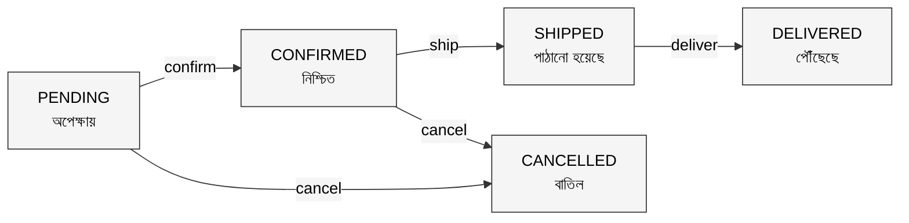
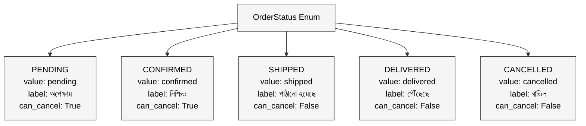

রিনা আপার একটা ছোট্ট অনলাইন শপ আছে।

ফেসবুকে পেজ, হাতে বানানো কাপড়ের গয়না, মাসে ৫০-৬০টা অর্ডার। ব্যবসা ভালোই চলছে।

কিন্তু অর্ডার ট্র্যাক করতে গিয়ে সমস্যা।

রিনা আপা নিজে লেখেন: "পেন্ডিং", "রেডি", "পাঠানো হয়েছে", "পৌঁছেছে"। তার হেল্পার সুমাইয়া লেখে: "wait", "ready to ship", "shipped", "delivered"। আরেকজন হেল্পার কামাল লেখে: "অপেক্ষায়", "তৈরি", "রাস্তায়", "পাইছে"।

মাস শেষে রিপোর্ট বানাতে গিয়ে মাথায় হাত। কতটা অর্ডার এখনো পেন্ডিং? কতটা shipped হয়েছে? কেউ বলতে পারছে না কারণ একই অবস্থার তিনটা আলাদা নাম।

এই সমস্যার নাম **magic strings** আর সমাধানের নাম **Enum।**

---

## ১. Enum কী?

রিনা আপা যদি সবাইকে বলতেন: "অর্ডারের অবস্থা লিখতে হলে শুধু এই পাঁচটা শব্দ ব্যবহার করবে: PENDING, CONFIRMED, SHIPPED, DELIVERED, CANCELLED। এর বাইরে কোনো শব্দ চলবে না।"

এই পাঁচটা নির্দিষ্ট শব্দের তালিকাটাই হলো **Enum (Enumeration)**।

Enum হলো একটা বিশেষ data type যেটা একটা fixed, predefined set of named constants ধরে রাখে। একবার define করলে সেই set-এর বাইরে কোনো value সম্ভব না।

```python
from enum import Enum

class OrderStatus(Enum):
    PENDING    = "pending"
    CONFIRMED  = "confirmed"
    SHIPPED    = "shipped"
    DELIVERED  = "delivered"
    CANCELLED  = "cancelled"
```

এখন কেউ `OrderStatus.SHIPED` লিখলে Python সাথে সাথে error দেবে। Typo করার সুযোগ নেই। "raste ache" লেখার সুযোগ নেই। শুধু পাঁচটা নির্দিষ্ট option।



Enum use না করলে এই flow-টা maintain করা কঠিন। যে কেউ যেকোনো string লিখতে পারে, ভুল state-ও set করতে পারে।

---

## ২. Simple Enum: শুধু নাম দরকার

সবচেয়ে সহজ Enum-এ শুধু names থাকে। কোনো extra value দরকার নেই।

Pathao ride-এর payment method ভাবো। হয় CASH, নয়তো CARD, নয়তো BKASH। তিনটার বাইরে কিছু নেই।

```python
from enum import Enum

class PaymentMethod(Enum):
    CASH   = 1
    CARD   = 2
    BKASH  = 3

# ব্যবহার
method = PaymentMethod.BKASH
print(method)        # PaymentMethod.BKASH
print(method.name)   # BKASH
print(method.value)  # 3

# Comparison সহজ
if method == PaymentMethod.BKASH:
    print("bKash দিয়ে পেমেন্ট নিচ্ছি")
```

Enum members-কে compare করা যায়, loop করা যায়, সহজেই check করা যায়:

```python
# সব payment method দেখো
for m in PaymentMethod:
    print(m.name, "->", m.value)

# CASH -> 1
# CARD -> 2
# BKASH -> 3
```

Simple Enum-এ value হিসেবে integer ব্যবহার করলে কাজ চলে। কিন্তু কখনো কখনো আরেকটু বেশি দরকার হয়।

---

## ৩. Enum with Properties and Methods: Enum-এ বুদ্ধি

রিনা আপার অর্ডার status-এর সাথে যদি আরও তথ্য রাখা দরকার হয়? যেমন, প্রতিটা status-এর একটা বাংলা label আর একটা description?

Enum-এ properties আর methods যোগ করা যায়।

```python
from enum import Enum

class OrderStatus(Enum):
    PENDING   = ("pending",   "অপেক্ষায়",        "অর্ডার পাওয়া গেছে, এখনো confirm হয়নি")
    CONFIRMED = ("confirmed", "নিশ্চিত হয়েছে",   "অর্ডার confirm, প্যাক করা হচ্ছে")
    SHIPPED   = ("shipped",   "পাঠানো হয়েছে",    "অর্ডার courier-এ দেওয়া হয়েছে")
    DELIVERED = ("delivered", "পৌঁছেছে",         "কাস্টমার পেয়ে গেছে")
    CANCELLED = ("cancelled", "বাতিল",           "অর্ডার বাতিল করা হয়েছে")

    def __new__(cls, code, label, description):
        obj = object.__new__(cls)
        obj._value_ = code
        obj.label = label
        obj.description = description
        return obj

    def is_active(self):
        return self in (OrderStatus.PENDING, OrderStatus.CONFIRMED, OrderStatus.SHIPPED)

    def can_cancel(self):
        return self in (OrderStatus.PENDING, OrderStatus.CONFIRMED)
```

এখন Enum শুধু নাম না, পুরো information ধরে রাখছে:

```python
status = OrderStatus.SHIPPED

print(status.value)       # shipped
print(status.label)       # পাঠানো হয়েছে
print(status.description) # অর্ডার courier-এ দেওয়া হয়েছে
print(status.is_active())  # True
print(status.can_cancel()) # False (shipped হয়ে গেলে আর cancel হয় না)
```



প্রতিটা Enum member এখন নিজেই জানে সে cancel করা যাবে কিনা, সে active কিনা। এই logic Enum-এর ভেতরেই থাকায় বাইরে বারবার লিখতে হয় না।

---

## বাস্তব উদাহরণ: Daraz-এর Order Processing

Daraz-এ প্রতিদিন লক্ষ লক্ষ অর্ডার হয়। প্রতিটা অর্ডার বিভিন্ন state-এর মধ্য দিয়ে যায়।

Enum ছাড়া এই system-এ কী সমস্যা হতো:

```python
# Enum ছাড়া: বিপদ
order["status"] = "shiped"    # typo, কেউ ধরতে পারবে না
order["status"] = "Delivered" # capital D, আলাদা string
order["status"] = "রাস্তায়"  # বাংলায় লিখলে?

if order["status"] == "shipped":  # এই check কাজ করবে না!
    notify_customer()
```

Enum দিয়ে:

```python
from enum import Enum

class OrderStatus(Enum):
    PLACED     = "placed"
    CONFIRMED  = "confirmed"
    PACKED     = "packed"
    SHIPPED    = "shipped"
    OUT_FOR_DELIVERY = "out_for_delivery"
    DELIVERED  = "delivered"
    RETURNED   = "returned"
    CANCELLED  = "cancelled"

class Order:
    def __init__(self, order_id, product):
        self.order_id  = order_id
        self.product   = product
        self.status    = OrderStatus.PLACED

    def confirm(self):
        if self.status == OrderStatus.PLACED:
            self.status = OrderStatus.CONFIRMED
            print(f"অর্ডার {self.order_id} confirm হয়েছে")

    def ship(self):
        if self.status == OrderStatus.PACKED:
            self.status = OrderStatus.SHIPPED
            print(f"অর্ডার {self.order_id} courier-এ দেওয়া হয়েছে")

    def cancel(self):
        if self.status in (OrderStatus.PLACED, OrderStatus.CONFIRMED):
            self.status = OrderStatus.CANCELLED
            print(f"অর্ডার {self.order_id} বাতিল")
        else:
            print(f"এই অবস্থায় cancel করা যাবে না: {self.status.value}")


# ব্যবহার
order = Order("DRZ-001", "কাপড়ের গয়না")
order.confirm()
order.ship()       # status PACKED না হওয়ায় কিছু হবে না
order.cancel()     # CONFIRMED অবস্থায় cancel হবে না কারণ ship হয়নি
```

Enum ব্যবহার করায় invalid state transition সম্ভব না। কেউ ভুলেও `order.status = "delvrd"` লিখতে পারবে না।

---

## সারসংক্ষেপ

| গল্পের ভাষায় | প্রযুক্তির ভাষায় |
|---|---|
| রিনা আপার পাঁচটা নির্দিষ্ট status শব্দ | Enum |
| প্রতিটা নির্দিষ্ট শব্দ | Enum member |
| শব্দের সাথে বাংলা label রাখা | Enum property |
| "shipped হলে cancel হবে না" নিয়ম | Enum method |
| যে কেউ যা খুশি লিখতে পারত | Magic strings (সমস্যা) |

**Enum ব্যবহার করলে invalid value set করা compiler বা runtime-এই আটকে যায়।**

**Enum members-এ property আর method রাখা যায়, তাই related logic একজায়গায় থাকে।**

**Code পড়তে সহজ হয়: `OrderStatus.SHIPPED` দেখলেই বোঝা যায়, `2` দেখলে বোঝা যায় না।**

---

> পরবর্তী প্রশ্ন: Class-এ যদি কিছু জিনিস লুকিয়ে রাখা যেত, শুধু দরকারি অংশটুকুই বাইরে দেখাত? সেই ধারণার নাম **Encapsulation।**

*OOP সিরিজের পরবর্তী পর্ব: Encapsulation, যা সবাইকে দেখানো যায় না*
