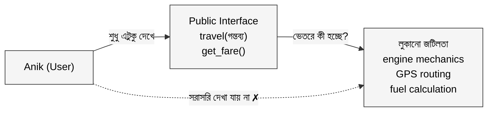
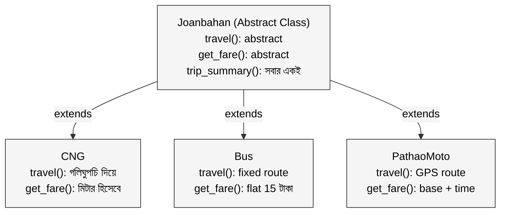

Anik প্রতিদিন সকালে university যায়।

সোমবার CNG-তে। মামু জিজ্ঞেস করেন: "কোথায় যাবেন?" Anik বলে: "BUET গেটে।" মামু চালু করেন engine, ধরেন রাস্তা, হিসাব করেন ভাড়া। Anik জানালার দিকে তাকিয়ে বসে থাকে।

বুধবার bus-এ। কোন গিয়ারে চলছে, injector কীভাবে fuel দিচ্ছে, brake পাড়লে কী হচ্ছে, সে কিছুই জানে না। সে শুধু উঠে পড়ে, বলে "BUET", টাকা দেয়।

শুক্রবার Pathao bike-এ। App-এ destination দেয়। Rider-এর GPS কীভাবে route optimize করে, কীভাবে traffic data নেয়, সে কিছুই দেখে না। শুধু জানে: গন্তব্যে পৌঁছাবে।

তিনটা আলাদা যানবাহন। তিনটা আলাদা engine, আলাদা technology, আলাদা routing system। কিন্তু Anik-এর কাছে experience একটাই: গন্তব্য বলো, পৌঁছে যাও।

এই ধারণার নাম **Abstraction।**

---

## ১. Abstraction কী?

Anik যানবাহন ব্যবহার করে, কিন্তু যানবাহনের ভেতরের জটিলতা থেকে সে মুক্ত। CNG-র engine কত HP, bus-এ কতটা hydraulic pressure লাগে transmission-এ, Pathao-র GPS কোন satellite থেকে signal নেয়, এসব তার জানার দরকার নেই। সে শুধু interface-এর সাথে কথা বলে: "গন্তব্য কোথায়?"

Programming-এ **Abstraction** ঠিক এটাই করে: complex internal implementation লুকিয়ে রাখে, বাইরে শুধু দরকারি অংশটুকু দেখায়।

সহজ সূত্র: **Abstraction = জটিলতা লুকানো + সরল interface দেখানো।**



Abstraction-এর সবচেয়ে বড় সুবিধা হলো **"what" আর "how" আলাদা করে ফেলা।** Anik জানে *কী* হবে (গন্তব্যে পৌঁছাবে), কিন্তু *কীভাবে* হবে সেটা জানার দরকার নেই। এই বিচ্ছিন্নতাটাই বড় software system-কে manageable করে তোলে।

---

## ২. Abstract Class: ভাগ করা blueprint

Anik-এর তিনটা যানবাহনের কথা ভাবো। CNG, bus, Pathao bike সবাই কিছু কাজ একভাবে করে, কিছু কাজ আলাদাভাবে। সবাই fare calculate করে, সবাই trip-এর summary দেয়। কিন্তু CNG-র চলার পদ্ধতি আর Pathao bike-এর চলার পদ্ধতি আলাদা।

এই situation-এর জন্যই **Abstract Class।**

Abstract class একটা shared blueprint দেয়: কিছু কাজের বাস্তবায়ন সে নিজেই লিখে দেয় (সবার জন্য একরকম), আর কিছু কাজের জন্য বলে "তুমি নিজে implement করো" (কারণ প্রতিটার পদ্ধতি আলাদা)।

```python
from abc import ABC, abstractmethod

class Joanbahan(ABC):  # Abstract Class
    def __init__(self, naam: str):
        self.naam = naam

    @abstractmethod
    def travel(self, gongtabya: str):
        # প্রতিটা যানবাহন নিজের মতো করে চলবে
        pass

    @abstractmethod
    def get_fare(self, duration_min: int) -> float:
        # fare calculation প্রতিটার আলাদা
        pass

    def trip_summary(self, gongtabya: str, duration: int):
        # এটা সবার জন্য একরকম, তাই এখানেই লেখা
        fare = self.get_fare(duration)
        print(f"যানবাহন: {self.naam}")
        print(f"গন্তব্য: {gongtabya}")
        print(f"ভাড়া: {fare:.0f} টাকা")
```

`trip_summary()` সব যানবাহনের জন্য একই, তাই abstract class-এই লেখা। কিন্তু `travel()` আর `get_fare()` প্রতিটার আলাদা, তাই `@abstractmethod` দিয়ে বলা হচ্ছে "তুমি নিজে ঠিক করো।"

```python
class CNG(Joanbahan):
    def travel(self, gongtabya: str):
        print(f"CNG মামু গলিঘুপচি দিয়ে {gongtabya} যাচ্ছেন...")

    def get_fare(self, duration_min: int) -> float:
        return duration_min * 4.5  # মিটার হিসেবে

class Bus(Joanbahan):
    def travel(self, gongtabya: str):
        print(f"বাস নির্দিষ্ট রুটে {gongtabya} যাচ্ছে...")

    def get_fare(self, duration_min: int) -> float:
        return 15.0  # fixed fare

class PathaoMoto(Joanbahan):
    def travel(self, gongtabya: str):
        print(f"Pathao rider GPS route নিয়ে {gongtabya} যাচ্ছে...")

    def get_fare(self, duration_min: int) -> float:
        return 25 + (duration_min * 3)  # base + time fare
```

এখন Anik-এর commute code দেখো:

```python
def commute(joanbahan: Joanbahan, gongtabya: str, duration: int):
    joanbahan.travel(gongtabya)
    joanbahan.trip_summary(gongtabya, duration)

# সোমবার
commute(CNG("Yellow CNG"), "BUET গেট", 20)
# CNG মামু গলিঘুপচি দিয়ে BUET গেট যাচ্ছেন...
# যানবাহন: Yellow CNG | গন্তব্য: BUET গেট | ভাড়া: 90 টাকা

# বুধবার
commute(Bus("৮ নং বাস"), "BUET গেট", 35)
# বাস নির্দিষ্ট রুটে BUET গেট যাচ্ছে...
# যানবাহন: ৮ নং বাস | গন্তব্য: BUET গেট | ভাড়া: 15 টাকা

# শুক্রবার
commute(PathaoMoto("Pathao Bike"), "BUET গেট", 15)
# Pathao rider GPS route নিয়ে BUET গেট যাচ্ছে...
# যানবাহন: Pathao Bike | গন্তব্য: BUET গেট | ভাড়া: 70 টাকা
```

`commute()` function কোনো specific যানবাহন চেনে না। সে শুধু `Joanbahan` interface জানে। কাল যদি electric scooter আসে, শুধু নতুন class বানাও। `commute()` এর একটা অক্ষরও বদলাতে হবে না।



---

## ৩. Abstraction বনাম Encapsulation

আগের article-এ Encapsulation পড়েছিলাম। দুটো শুনতে কাছাকাছি, কিন্তু আলাদা জায়গা থেকে দেখে।

**Encapsulation** বলে: data লুকাও, সরাসরি ছুঁতে দিও না। এটা ভেতরের সুরক্ষার কথা। bKash-এর `__balance` variable private রাখা, PIN ছাড়া access না দেওয়া।

**Abstraction** বলে: জটিলতা লুকাও, সরল interface দেখাও। এটা বাইরের দৃষ্টিভঙ্গির কথা। Anik শুধু `travel("BUET")` বলে, engine-এর details জানার দরকার নেই।

গাড়ির উদাহরণে বললে: accelerator pedal হলো Abstraction (চাপো, বাকিটা জানার দরকার নেই), আর engine-এর sealed housing হলো Encapsulation (ভেতরে হাত দিতে পারবে না)।

| দিক | Encapsulation | Abstraction |
|---|---|---|
| লক্ষ্য | data রক্ষা করা | জটিলতা লুকানো |
| দৃষ্টিভঙ্গি | ভেতর থেকে | বাইরে থেকে |
| উদাহরণ | `__balance` private রাখা | শুধু `travel()` দেখানো |
| প্রশ্ন | "কে দেখতে পারবে?" | "এটা জেনে কী লাভ?" |

দুটো একসাথে কাজ করে। Encapsulation protect করে, Abstraction simplify করে।

---

## বাস্তব উদাহরণ: Shohoz-এর Notification System

Shohoz একটা order confirm হলে customer-কে notify করতে চায়। পাঠানোর পথ তিনটা: SMS, push notification, email। তিনটার internal mechanism আলাদা, কিন্তু কাজ একটাই: message deliver করো।

```python
from abc import ABC, abstractmethod

class NotificationSender(ABC):
    def __init__(self, sender_name: str):
        self.sender_name = sender_name

    @abstractmethod
    def send(self, recipient: str, message: str) -> bool:
        pass

    def log_attempt(self, recipient: str):
        # সব sender-এর জন্য একই logging, একবারই লেখা
        print(f"[{self.sender_name}] Notifying: {recipient}")

class SMSSender(NotificationSender):
    def send(self, recipient: str, message: str) -> bool:
        self.log_attempt(recipient)
        # SMS gateway API call... (জটিল কোড লুকানো)
        print(f"SMS sent to {recipient}: {message[:50]}...")
        return True

class PushSender(NotificationSender):
    def send(self, recipient: str, message: str) -> bool:
        self.log_attempt(recipient)
        # Firebase FCM API call... (জটিল কোড লুকানো)
        print(f"Push notification sent to device: {recipient}")
        return True

class EmailSender(NotificationSender):
    def send(self, recipient: str, message: str) -> bool:
        self.log_attempt(recipient)
        # SMTP handshake, email rendering... (জটিল কোড লুকানো)
        print(f"Email delivered to {recipient}")
        return True


# OrderService শুধু NotificationSender চেনে, implementation না
class OrderService:
    def __init__(self, notifier: NotificationSender):
        self.notifier = notifier

    def confirm_order(self, order_id: str, customer_contact: str):
        message = f"অর্ডার #{order_id} confirm! শীঘ্রই পৌঁছে যাবে।"
        self.notifier.send(customer_contact, message)
```

```python
# SMS দিয়ে notify
service = OrderService(SMSSender("SSL SMS Gateway"))
service.confirm_order("SHZ-9921", "01711-XXXXX")

# Push notification দিয়ে notify, OrderService-এর code একটুও বদলায়নি
service = OrderService(PushSender("Firebase"))
service.confirm_order("SHZ-9921", "device_token_xyz")
```

`OrderService` জানে না notification কীভাবে যাচ্ছে। সে শুধু `send()` বলে। আজ SMS, কাল WhatsApp আসলেও `OrderService` ছুঁতে হবে না। `log_attempt()` একবার লেখা, সব sender inherit করে নেয়।

---

## সারসংক্ষেপ

| গল্পের ভাষায় | প্রযুক্তির ভাষায় |
|---|---|
| Anik শুধু "BUET যাবো" বলে | Abstract method call করা |
| CNG, bus, Pathao আলাদাভাবে চলে | Concrete class-এর implementation |
| Trip summary সবার জন্য একরকম | Abstract class-এর concrete method |
| Anik engine বোঝে না, দরকারও নেই | Implementation hiding |
| নতুন যানবাহন এলে Anik-এর কিছু বদলে না | Open for extension, closed for modification |

**Abstraction মানে "what" আর "how" আলাদা করা। User শুধু "what" জানবে, "how" জানার দরকার নেই।**

**Abstract class shared behavior একবার লেখে। Subclass সেটা inherit করে, নিজের আলাদা অংশটুকু নিজে implement করে।**

**Encapsulation data protect করে, Abstraction complexity hide করে। দুটো একসাথে কাজ করে।**

---

> পরবর্তী প্রশ্ন: একটা class যদি অন্য class-এর সব গুণ পেয়ে যায়, সাথে নিজের কিছু যোগ করতে পারে? সেই ধারণার নাম **Inheritance।**

*OOP সিরিজের পরবর্তী পর্ব: Inheritance, বাবার গুণ ছেলেতে*
