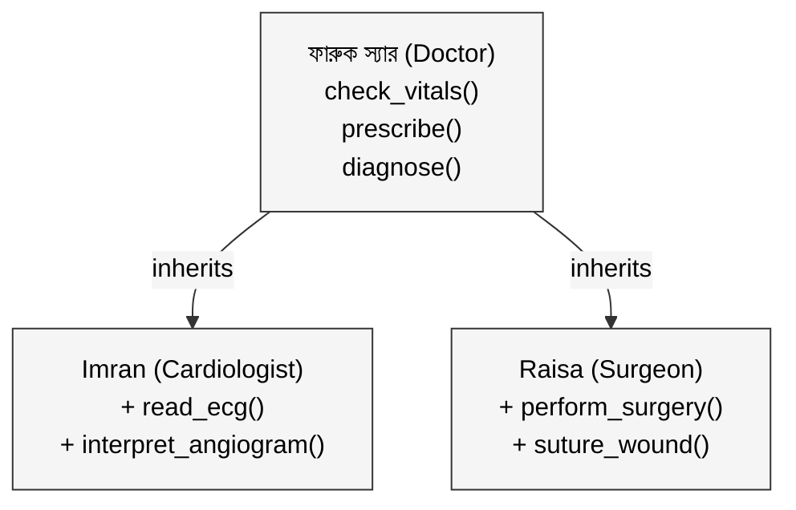
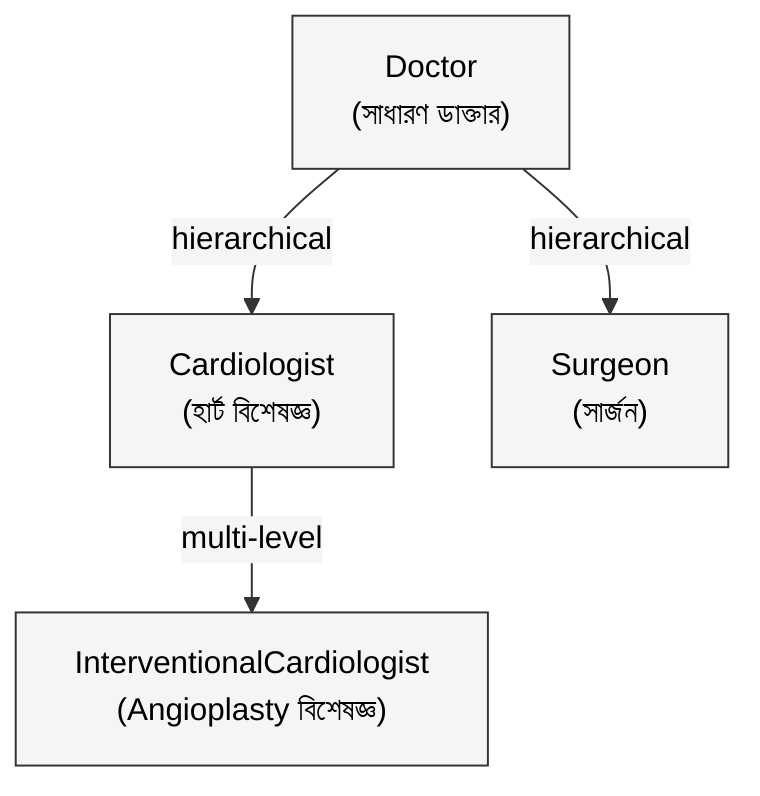

ফারুক স্যারের চেম্বার ঢাকা মেডিকেলের কাছে।

৩০ বছর ধরে practice করছেন। General physician। যে কেউ এলে দেখেন: vital sign check করেন, রোগ diagnose করেন, prescription লেখেন।

তাঁর বড় ছেলে Imran। ছোটবেলা থেকে বাবার চেম্বারে বসেছে। শিখেছে: patient কীভাবে দেখতে হয়, blood pressure কীভাবে মাপতে হয়, prescription কীভাবে লিখতে হয়। তারপর specialization করেছে হার্টে। এখন নিজের cardiology clinic। ECG পড়তে পারে, angiogram interpret করতে পারে। এগুলো বাবার কাছ থেকে শেখেনি, নিজে অর্জন করেছে।

ছোট মেয়ে Raisa। বাবার কাছ থেকে একই মূল জিনিস শিখেছে। Patient দেখা, vital check, prescription। তারপর গেছে surgery-তে। এখন operation theatre-এ সে বস। ক্ষত suture করতে পারে, appendix বের করতে পারে। এগুলোও বাবার কাছ থেকে শেখেনি।

তিনজনই ডাক্তার। তিনজনই একই মূল কাজ জানেন। Imran আর Raisa বাবার শেখানো সবটুকু নিয়ে নিজেদের বিশেষত্ব যোগ করেছেন।

এই ধারণার নাম **Inheritance।**

---

## ১. Inheritance কী এবং কেন দরকার?

ফারুক স্যার যদি Imran আর Raisa দুজনকে আলাদাভাবে পুরো ডাক্তারি শেখাতেন, vital sign থেকে শুরু করে prescription পর্যন্ত সব duplicate করে, তাহলে কত সময় নষ্ট হতো। পরে কোথাও ভুল থাকলে দুজনের কাছেই গিয়ে ঠিক করতে হতো।

Programming-এ **Inheritance** ঠিক এই সমস্যার সমাধান করে। একটা class (parent বা superclass) যা জানে, সেটা অন্য class (child বা subclass) সরাসরি পেয়ে যায়। Child তারপর নিজের বিশেষ জিনিস যোগ করে।

Inheritance চারটা বড় সুবিধা দেয়।

প্রথমত, **code reuse**: common logic একবার লেখো, সব child-এ পেয়ে যাবে। দ্বিতীয়ত, **স্বাভাবিক hierarchy**: "Cardiologist is-a Doctor" এই real-world সম্পর্কটা code-এ সরাসরি দেখা যায়। তৃতীয়ত, **maintenance সহজ**: parent-এ bug ঠিক করলে সব child-এও ঠিক হয়ে যায়। চতুর্থত, **Polymorphism-এর ভিত্তি**: পরের article-এ এটা দেখব।



---

## ২. Code-এ কীভাবে কাজ করে?

```python
class Doctor:
    def __init__(self, naam: str, degree: str):
        self.naam = naam
        self.degree = degree

    def check_vitals(self, patient: str):
        print(f"{self.naam}: {patient}-এর vital signs check করছেন")

    def prescribe(self, patient: str, medicine: str):
        print(f"{self.naam}: {patient}-কে {medicine} দিলেন")

    def diagnose(self, symptom: str) -> str:
        print(f"{self.naam}: '{symptom}' দেখে diagnose করছেন")
        return "General assessment"
```

এখন Imran আর Raisa দুজনেই Doctor থেকে inherit করবে, তারপর নিজের জিনিস যোগ করবে:

```python
class Cardiologist(Doctor):
    def __init__(self, naam: str):
        super().__init__(naam, "MBBS + MD (Cardiology)")  # বাবার constructor ডাকো

    def read_ecg(self, patient: str):
        print(f"{self.naam}: {patient}-এর ECG রিপোর্ট পড়ছেন")

    def interpret_angiogram(self, result: str):
        print(f"{self.naam}: Angiogram: {result}")


class Surgeon(Doctor):
    def __init__(self, naam: str, theatre: str):
        super().__init__(naam, "MBBS + MS (Surgery)")
        self.theatre = theatre

    def perform_surgery(self, patient: str, operation: str):
        print(f"{self.naam}: {self.theatre}-এ {patient}-এর {operation} করছেন")

    def suture_wound(self, patient: str):
        print(f"{self.naam}: {patient}-এর wound suture করলেন")
```

```python
imran = Cardiologist("Dr. Imran")
raisa = Surgeon("Dr. Raisa", "Operation Theatre 3")

# বাবার কাছ থেকে পাওয়া methods
imran.check_vitals("রহিম সাহেব")
imran.prescribe("রহিম সাহেব", "Aspirin")

# নিজের বিশেষ method
imran.read_ecg("রহিম সাহেব")

# Raisa-ও বাবার method পেয়েছে
raisa.check_vitals("করিম সাহেব")
raisa.perform_surgery("করিম সাহেব", "Appendectomy")
```

`super().__init__()` দিয়ে child তার parent-এর constructor call করে। এটা দিয়েই বলা হচ্ছে "বাবার কাছ থেকে প্রাথমিক সব নিয়ে নিচ্ছি।"

Child চাইলে parent-এর method **override** করতেও পারে। ধরো Imran heart disease-এর জন্য আলাদাভাবে diagnose করে:

```python
class Cardiologist(Doctor):
    # ...

    def diagnose(self, symptom: str) -> str:  # override
        print(f"{self.naam}: '{symptom}' দেখে cardiac assessment করছেন")
        return "Cardiac evaluation needed"
```

এখন `imran.diagnose("বুকে ব্যথা")` ডাকলে parent-এর version নয়, Imran-এর নিজের version চলবে।

---

## ৩. Inheritance-এর ধরন

**Single Inheritance** সবচেয়ে সহজ: একটা child, একটা parent। `Cardiologist extends Doctor`। সব language-এ supported।

**Hierarchical Inheritance** এর মানে হলো একই parent থেকে একাধিক child। ফারুক স্যারের কাছ থেকে Imran আর Raisa দুজনই inherit করছে। এটা সবচেয়ে common।

**Multi-level Inheritance** মানে chain: parent → child → grandchild। যেমন ফারুক স্যারের পর Imran, Imran-এর পর তার ছাত্র একজন Interventional Cardiologist।



**Multiple Inheritance** (একটা child, একাধিক parent) Python-এ সম্ভব কিন্তু বিপজ্জনক। ধরো `Imran` যদি `Doctor` আর `Researcher` দুটো class থেকেই inherit করতে চায়। দুটোতেই যদি `publish()` method থাকে, তাহলে Imran কোনটা নেবে? এটাকে বলে **Diamond Problem।** এই কারণে Java, C#-এ একাধিক class থেকে extend করা যায় না, কিন্তু multiple interface implement করা যায়।

---

## ৪. কখন Inheritance ব্যবহার করবে?

একটাই সহজ নিয়ম: **"is-a" সম্পর্ক থাকলে inheritance, "has-a" সম্পর্ক থাকলে না।**

Cardiologist **is-a** Doctor। ✅ Inheritance ঠিক আছে।
Car **has-a** Engine। ❌ Inheritance না, composition ব্যবহার করো।

আরো কিছু চেকলিস্ট:

| ব্যবহার করো | ব্যবহার করো না |
|---|---|
| Clear "is-a" সম্পর্ক আছে | "has-a" বা "uses-a" সম্পর্ক |
| Common behavior share করতে হবে | Runtime-এ behavior swap করতে হবে |
| Hierarchy shallow (২-৩ level) | Deep hierarchy (৫+ level) |
| Parent-এর সব behavior child-এ valid | Child parent-এর কোনো method ভাঙে |

সন্দেহ হলে composition দিয়ে শুরু করো। পরে দরকার হলে inheritance-এ যাওয়া সহজ। কিন্তু একটা গভীর inheritance tree ভেঙে composition-এ নামা অনেক কঠিন।

---

## বাস্তব উদাহরণ: গার্মেন্টস ফ্যাক্টরির Staff System

বাংলাদেশের একটা garment factory-তে বিভিন্ন ধরনের staff আছেন। সবাই factory-র কর্মী, সবাই কিছু common কাজ করেন: punch in/out করেন, salary পান। কিন্তু Production Worker, QC Inspector, আর Supervisor-এর কাজ আলাদা।

```python
class Kormi:  # Staff (base class)
    def __init__(self, naam: str, id: str, salary: float):
        self.naam = naam
        self.id = id
        self.salary = salary

    def punch_in(self):
        print(f"{self.naam} ({self.id}) কাজে এসেছেন")

    def punch_out(self):
        print(f"{self.naam} কাজ শেষ করেছেন")

    def get_salary(self) -> float:
        return self.salary


class ProductionWorker(Kormi):
    def __init__(self, naam: str, id: str, salary: float, machine_no: int):
        super().__init__(naam, id, salary)
        self.machine_no = machine_no

    def operate_machine(self):
        print(f"{self.naam} machine #{self.machine_no} চালাচ্ছেন")

    def report_output(self, pieces: int):
        print(f"{self.naam}: আজ {pieces} পিস তৈরি করেছেন")


class QCInspector(Kormi):
    def __init__(self, naam: str, id: str, salary: float):
        super().__init__(naam, id, salary)

    def inspect_batch(self, batch_id: str) -> bool:
        print(f"{self.naam}: Batch #{batch_id} quality check করছেন")
        return True

    def reject_item(self, item_id: str, reason: str):
        print(f"{self.naam}: Item #{item_id} reject: {reason}")


class Supervisor(ProductionWorker):   # multi-level: Supervisor is-a ProductionWorker is-a Kormi
    def __init__(self, naam: str, id: str, salary: float, machine_no: int, team_size: int):
        super().__init__(naam, id, salary, machine_no)
        self.team_size = team_size

    def approve_leave(self, worker_naam: str):
        print(f"{self.naam}: {worker_naam}-এর ছুটি approve করলেন")

    def daily_report(self, total_output: int):
        print(f"{self.naam}-এর team: আজ মোট {total_output} পিস, {self.team_size} জন কর্মী")
```

```python
karim = ProductionWorker("কারিম মিয়া", "W-101", 12000, machine_no=5)
ruma  = QCInspector("রুমা বেগম", "Q-203", 15000)
jalal = Supervisor("জলিল সাহেব", "S-301", 22000, machine_no=1, team_size=12)

# সবাই Kormi-র method পেয়েছে
karim.punch_in()
ruma.punch_in()
jalal.punch_in()

# নিজস্ব method
karim.operate_machine()
ruma.inspect_batch("B-4421")
jalal.approve_leave("কারিম মিয়া")

# Supervisor is-a ProductionWorker, তাই এটাও পারে
jalal.operate_machine()
jalal.daily_report(480)
```

নতুন role আসলে, যেমন `AccountsStaff`, শুধু `Kormi` থেকে extend করো। বাকি সব code অপরিবর্তিত থাকবে।

---

## সারসংক্ষেপ

| গল্পের ভাষায় | প্রযুক্তির ভাষায় |
|---|---|
| ফারুক স্যারের কাছ থেকে basic ডাক্তারি শেখা | Parent class-এর methods inherit করা |
| Imran হার্ট বিশেষজ্ঞ হওয়া | Child class-এ নতুন method যোগ করা |
| Imran নিজের মতো diagnose করা | Method override করা |
| Imran "is-a" Doctor | "is-a" relationship |
| Raisa doctor, Imran doctor: দুজনই বাবার কাছে শিখেছে | Hierarchical inheritance |
| Imran-এর ছাত্র আরো বিশেষজ্ঞ | Multi-level inheritance |

**Inheritance মানে parent-এর সব নিয়ে তার উপর নিজের বিশেষত্ব যোগ করা।**

**"is-a" সম্পর্ক থাকলেই inheritance ব্যবহার করো, "has-a" হলে composition।**

**Hierarchy shallow রাখো (২-৩ level), নইলে code বোঝা ও maintain করা কঠিন হয়ে যায়।**

---

> পরবর্তী প্রশ্ন: ফারুক স্যার, Imran, আর Raisa তিনজনকে একটাই method-এ দিলে, তিনজনই নিজের মতো behave করবে? সেই ধারণার নাম **Polymorphism।**

*OOP সিরিজের পরবর্তী পর্ব: Polymorphism, একই call, আলাদা আলাদা কাজ*
