## ভূমিকা

ধরো, ঢাকার মোহাম্মদপুরে রাশেদ ভাই একটা ছোট্ট চায়ের দোকান খুললেন।

প্রথম দিন ১০ জন কাস্টমার। রাশেদ ভাই একাই চা বানালেন, টাকা নিলেন, সব সামলালেন। কোনো সমস্যা নেই।

এক মাস পর ৫০ জন।

তিন মাস পর ২০০ জন।

ঈদের দিন? সারা পাড়া এসে হাজির: ৫০০ মানুষ।

রাশেদ ভাই একা আর পারছেন না। চুলা একটা, হাত দুটো, আর মাথায় ঘাম। কাস্টমাররা বিরক্ত হয়ে চলে যাচ্ছে।

এই সমস্যাটার নাম **স্কেলেবিলিটি সমস্যা।**

সফটওয়্যারের দুনিয়ায় এটা প্রতিটা সফল অ্যাপের গল্প। ১,০০০ ইউজারে যে সিস্টেম ঝরঝরে চলে, ১০,০০০ ইউজারে সেটা হাঁপাতে শুরু করে। ১০ লাখ ইউজারে? ধপাস।

স্কেলেবিলিটি হলো সেই ক্ষমতা: যার কারণে একটা সিস্টেম ইউজার বাড়লেও ভেঙে পড়ে না, বরং গ্রেস্ফুলি সামলে নেয়।

---

## ১. স্কেলেবিলিটি মাপা যায় কীভাবে?

রাশেদ ভাই যদি বলেন "আমার দোকান স্লো হয়ে গেছে": এটা কোনো কাজের কথা না।

কিন্তু যদি বলেন "আগে প্রতি মিনিটে ৩০ কাপ চা দিতে পারতাম, এখন ১০ মিনিটে একজনকে দিতে পারছি না": তাহলে বোঝা যায় সমস্যাটা কোথায়।

সফটওয়্যারেও তাই, স্কেলেবিলিটি মাপা হয় কিছু নির্দিষ্ট সংখ্যা দিয়ে।

| মেট্রিক | মানে | উদাহরণ |
|---|---|---|
| RPS (Requests Per Second) | প্রতি সেকেন্ডে কতটা রিকোয়েস্ট সামলাতে পারে | ১০,০০০ RPS |
| Concurrent Users | একই সময়ে কতজন একটিভ থাকতে পারে | ৫০,০০০ জন |
| Throughput | প্রতি সেকেন্ডে কতটা ডেটা ট্রান্সফার হচ্ছে | ১ GB/s |
| Latency | রিকোয়েস্ট পাঠানো থেকে রেসপন্স পাওয়া পর্যন্ত সময় | ৫০ms |

### লোড বাড়লে কী হয়?

ধরো রাশেদ ভাইয়ের দোকানে স্বাভাবিক দিনে একটা চা বানাতে লাগে ৩০ সেকেন্ড।

| কাস্টমার সংখ্যা | অপেক্ষার সময় | অবস্থা |
|---|---|---|
| ১০ জন (স্বাভাবিক) | ৩০ সেকেন্ড | স্বাভাবিক |
| ২০ জন | ৩৩ সেকেন্ড | চমৎকার, খুব একটা বাড়েনি |
| ৫০ জন | ৪৫ সেকেন্ড | ভালোই আছে |
| ১০০ জন | ১.৫ মিনিট | একটু বাড়ছে, সামলানো যাচ্ছে |
| ১০০ জন | ৫ মিনিট | সমস্যা শুরু, বোতলনেক আসছে |
| ১০০ জন | দোকান বন্ধ | সিস্টেম ক্র্যাশ |

একটা ভালো সিস্টেমের লক্ষ্য হলো লোড দ্বিগুণ হলেও রেসপন্স টাইম যেন দ্বিগুণ না হয়। সেটাই **লিনিয়ার বা সাবলিনিয়ার স্কেলিং।**

---

## ২. ভার্টিকাল স্কেলিং: বড় চুলা কিনে আনো

সমস্যা বুঝে রাশেদ ভাই প্রথমে যা করলেন, সেটা সবচেয়ে সহজ সমাধান।

পুরনো একটা ছোট চুলা ছিল। সেটা বদলে কিনে আনলেন বড় ইন্ডাস্ট্রিয়াল চুলা। চায়ের কেতলি বদলে নিলেন বড় পাতিল। একটু বেশি জায়গা হলো।

এটাই **ভার্টিকাল স্কেলিং (Scale Up)।**

সফটওয়্যারে মানে হলো: একটাই সার্ভার রাখো, কিন্তু সেটার ক্ষমতা বাড়াও।

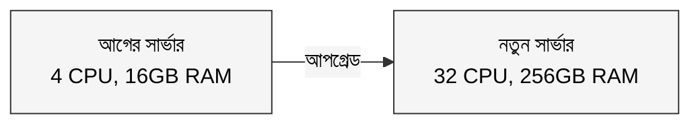

### কী কী আপগ্রেড করা যায়?

- **CPU বাড়াও**: যখন কাজ হিসাব-নিকাশের বেশি
- **RAM বাড়াও**: যখন বেশি ডেটা মেমোরিতে রাখতে হয়
- **SSD লাগাও**: যখন ডিস্ক রিড-রাইট স্লো
- **নেটওয়ার্ক কার্ড আপগ্রেড করো**: যখন ব্যান্ডউইথ সমস্যা

### সুবিধা ও সীমাবদ্ধতা

**ভালো দিক:**
- কোড একটুও বদলাতে হয় না
- সব ডেটা এক জায়গায়, নেটওয়ার্ক ঝামেলা নেই
- সহজ, দ্রুত সমাধান

**খারাপ দিক:**
- পৃথিবীর সবচেয়ে বড় সার্ভারেরও একটা লিমিট আছে
- একটাই সার্ভার মানে: সেটা বন্ধ হলে পুরো সিস্টেম বন্ধ
- বড় সার্ভার কিনতে দাম অনেক বেশি, দ্বিগুণ ক্ষমতার জন্য চার গুণ টাকা লাগে

রাশেদ ভাই বড় চুলা কিনলেন, কিন্তু ঈদের দিন আবার একই সমস্যা। এবার আর বড় চুলা নেই দোকানে। তাহলে?

---

## ৩. হরিজোন্টাল স্কেলিং: নতুন শাখা খোলো

রাশেদ ভাই এবার বুদ্ধি করলেন। একটা বড় চুলার বদলে তিনটা ছোট চুলা রাখলেন। সাথে দুজন হেল্পার রাখলেন। দরজায় একজন মানুষ দাঁড় করালেন, যে দেখে কোন চুলা ফাঁকা আছে, সেখানে কাস্টমারকে পাঠিয়ে দিচ্ছে।

এটাই **হরিজোন্টাল স্কেলিং (Scale Out)।**

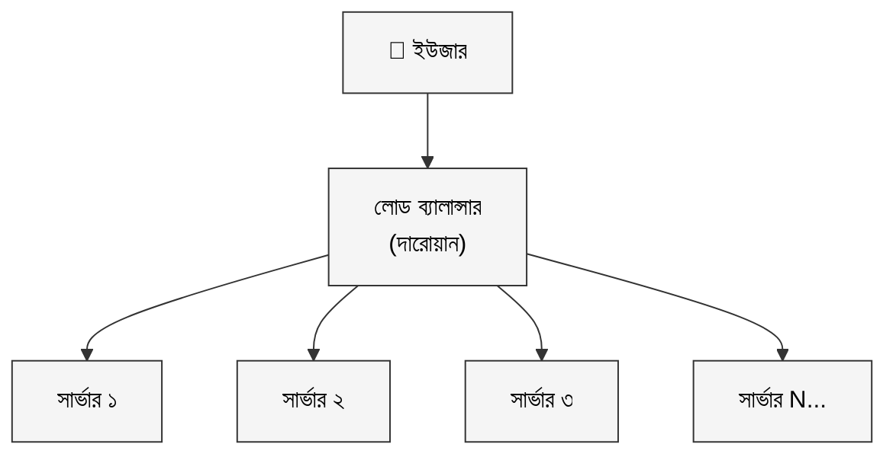

এই পদ্ধতিতে Google, Netflix, Amazon এদের মতো কোম্পানি কোটি কোটি রিকোয়েস্ট সামলায়।

### সুবিধা ও সীমাবদ্ধতা

**ভালো দিক:**
- কোনো হার্ড লিমিট নেই, দরকার হলে আরও সার্ভার যোগ করো
- একটা সার্ভার বন্ধ হলে বাকিগুলো চলতে থাকে
- ছোট ছোট সার্ভার একসাথে বড় সার্ভারের চেয়ে অনেক সস্তা
- পৃথিবীর বিভিন্ন জায়গায় সার্ভার রাখা যায়

**খারাপ দিক:**
- সিস্টেম জটিল হয়ে যায়
- অনেক সার্ভারে ডেটা মিলিয়ে রাখা কঠিন
- সার্ভারে সার্ভারে কথা বলতে সময় লাগে

---

## ৪. স্টেটলেস বনাম স্টেটফুল: সার্ভার কি কিছু মনে রাখে?

এখানে একটা মজার সমস্যা আছে।

ধরো রাশেদ ভাইয়ের দোকানে তুমি গেলে, ওনাকে বললে "ভাই, আমি সবসময় আধা চামচ চিনি দিয়ে চা খাই।" রাশেদ ভাই মনে রাখলেন।

পরের দিন গেলে: দেখো, অন্য হেল্পার বসে আছে। সে তোমাকে চেনে না। আবার চিনির কথা বলতে হলো।

এটাই **স্টেটফুল** এর সমস্যা। একটা সার্ভার তোমার সেশন মনে রাখলে, প্রতিবার তোমাকে সেই একই সার্ভারে যেতে হবে।

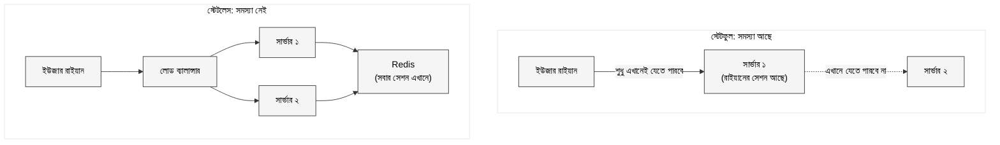

**সমাধান হলো স্টেটলেস আর্কিটেকচার।**

সার্ভার নিজে কিছু মনে রাখবে না। সব সেশন ডেটা রাখা হবে একটা শেয়ার্ড জায়গায়: যেমন Redis। যেকোনো সার্ভার সেখান থেকে পড়ে নেবে।

এটা করতে হলে:
- সেশন ডেটা Redis বা Memcached এ রাখো
- JWT Token ব্যবহার করো, সার্ভার-সাইড সেশনের বদলে
- ফাইল আপলোড হলে S3 এর মতো অবজেক্ট স্টোরেজে রাখো, সার্ভারের ডিস্কে না

---

## ৫. বিভিন্ন অংশ কীভাবে স্কেল করতে হয়

একটা সিস্টেম অনেক অংশ নিয়ে তৈরি। প্রতিটা অংশের স্কেলিং আলাদা।

### অ্যাপ্লিকেশন সার্ভার: সবচেয়ে সহজ

অ্যাপ সার্ভার স্কেল করা সবচেয়ে সহজ, যদি সেটা স্টেটলেস হয়।

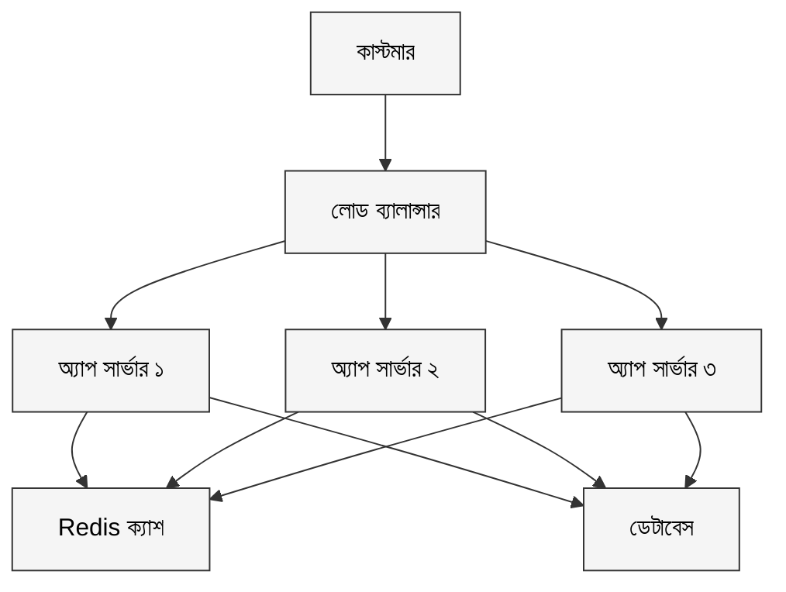

লোড বেড়ে গেলে আরও সার্ভার যোগ করো। ব্যস।

---

### ডেটাবেস: সবচেয়ে কঠিন

ডেটাবেস স্কেল করা কঠিন কারণ এখানে ডেটা থাকে। অ্যাপ সার্ভারের মতো শুধু আরও কপি চালু করলেই হয় না।

ধরো রাশেদ ভাইয়ের দোকানে একটা খাতায় সব অর্ডার লেখা থাকে। এই খাতার কপি করা যায়, কিন্তু সব কপিতে একই তথ্য রাখা: সেটা চ্যালেঞ্জ।

ডেটাবেসের বোতলনেক কোথায় সেটার উপর নির্ভর করে সমাধান আলাদা:

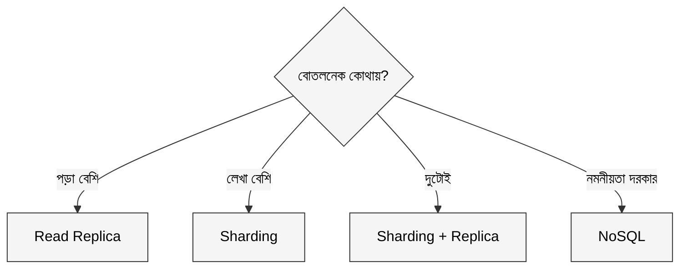

#### ক. Read Replica: পড়ার জন্য আলাদা কপি

বেশিরভাগ অ্যাপে পড়া হয় বেশি, লেখা হয় কম। bKash এর কথা ভাবো: লক্ষ মানুষ ব্যালান্স চেক করছে, কিন্তু ট্রানজেকশন হচ্ছে তুলনামূলক কম।

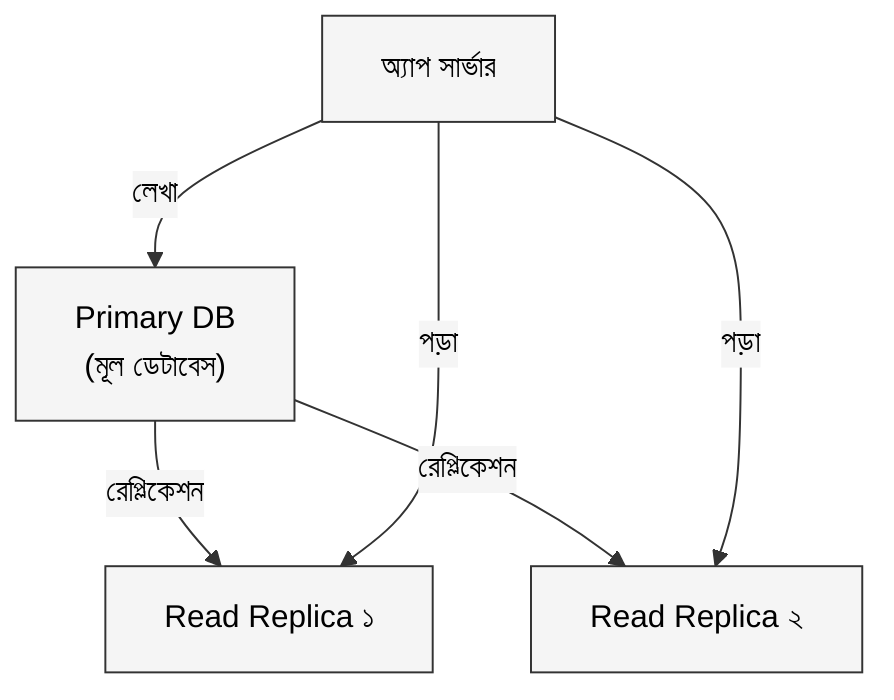

Primary সব লেখা সামলায়, Replica শুধু পড়ার রিকোয়েস্ট দেয়। একটু পিছিয়ে থাকতে পারে (Replication Lag), কিন্তু বেশিরভাগ ক্ষেত্রে সেটা সমস্যা না।

#### খ. Sharding: ডেটা ভাগ করে রাখো

যখন লেখাও বেশি, তখন একটা ডেটাবেসে কুলাবে না।

ধরো রাশেদ ভাইয়ের চেইন হয়ে গেছে তিনটা শাখায়। মোহাম্মদপুরের শাখা শুধু মোহাম্মদপুরের কাস্টমারদের ডেটা রাখে। গুলশানের শাখা গুলশানেরটা। মিরপুরের শাখা মিরপুরেরটা।

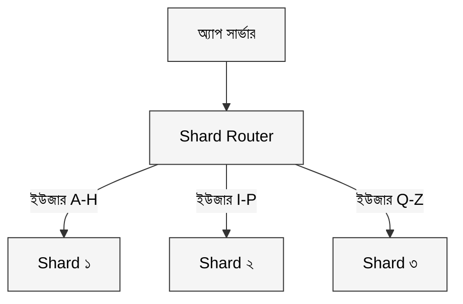

**সাধারণ Sharding কৌশল:**
- **Range-based:** নামের প্রথম অক্ষর দিয়ে ভাগ (A-H, I-P, Q-Z)
- **Hash-based:** User ID হ্যাশ করে ভাগ
- **Directory-based:** একটা ম্যাপ রাখো, কে কোন Shard এ আছে

---

### ক্যাশ: মনে রেখো সবচেয়ে জনপ্রিয় জিনিস

ধরো রাশেদ ভাইয়ের দোকানে ৯০% মানুষ আদা চা অর্ডার করে। তিনি এখন সকালেই একটু আদা ফুটিয়ে রাখেন। অর্ডার আসলে ডেটাবেসে (রেসিপি বইতে) যেতে হয় না, সরাসরি বানিয়ে দেন।

এটাই **ক্যাশিং।**

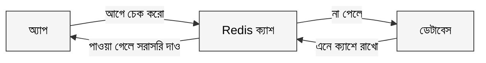

Redis একটাই নোডে ১,০০,০০০ এর বেশি অপারেশন প্রতি সেকেন্ডে সামলাতে পারে। ডেটাবেসের তুলনায় এটা ১০০ গুণ বেশি।

---

### মেসেজ কিউ: টোকেন সিস্টেম

ঈদের দিন রাশেদ ভাইয়ের দোকানে ভিড় এত বেশি যে, সবাইকে লাইনে দাঁড় করানো যাচ্ছে না। তিনি বুদ্ধি করে একটা টোকেন সিস্টেম চালু করলেন।

কেউ এলে টোকেন নেয়, যার নম্বর আসে সে চা পায়। রাশেদ ভাই নিজের গতিতে বানান।

এটাই **মেসেজ কিউ।**

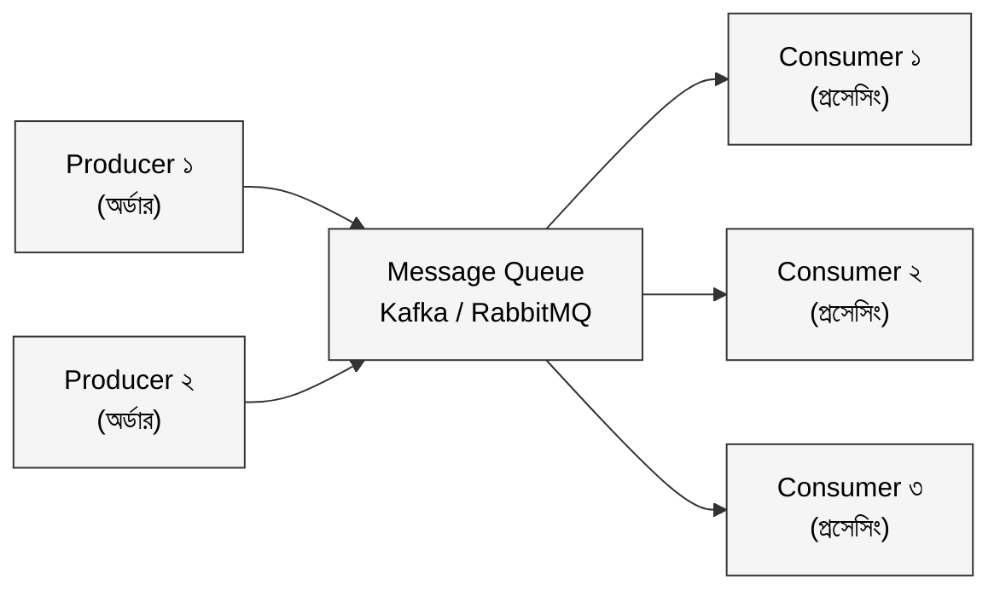

এতে Producer আর Consumer আলাদাভাবে স্কেল করা যায়। হঠাৎ ট্র্যাফিক স্পাইক আসলে কিউ সেটা ধরে রাখে, সার্ভার ক্র্যাশ করে না।

---

## ৬. বাস্তব গল্প: ০ থেকে কোটি ইউজার

ধরো Shohoz Food এর মতো একটা ফুড ডেলিভারি অ্যাপ শুরু হচ্ছে। কীভাবে এটা বাড়তে বাড়তে কোটি ইউজার সামলাবে?

### ধাপ ১: শুরুর দিন (০ থেকে ১০,০০০ ইউজার)

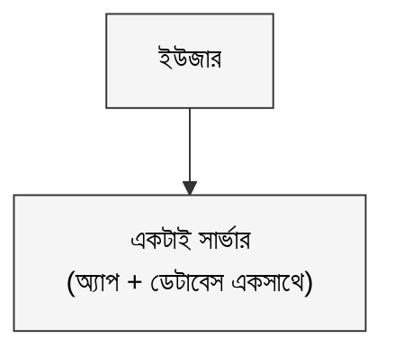

সব একটা সার্ভারে। সহজ, সস্তা। ডিবাগ করাও সহজ। কোনো ঝামেলা নেই।

**সমস্যা কখন শুরু হয়:** অ্যাপ আর ডেটাবেস একই সার্ভারে থাকায় তারা CPU আর RAM নিয়ে মারামারি শুরু করে।

---

### ধাপ ২: ডেটাবেস আলাদা করো (১০,০০০ থেকে ১,০০,০০০ ইউজার)

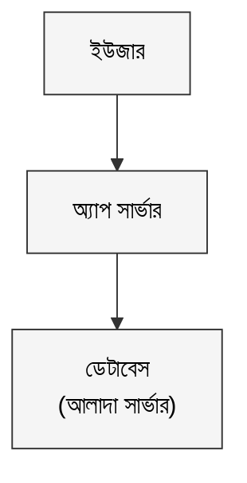

এখন অ্যাপ সার্ভার আর ডেটাবেস আলাদা মেশিনে। প্রতিটাকে আলাদাভাবে টিউন করা যাচ্ছে।

**সমস্যা কখন শুরু হয়:** ডেটাবেসে কোয়েরি বেড়ে যাচ্ছে, পড়া স্লো হচ্ছে।

---

### ধাপ ৩: ক্যাশ যোগ করো (১,০০,০০০ থেকে ৫,০০,০০০ ইউজার)

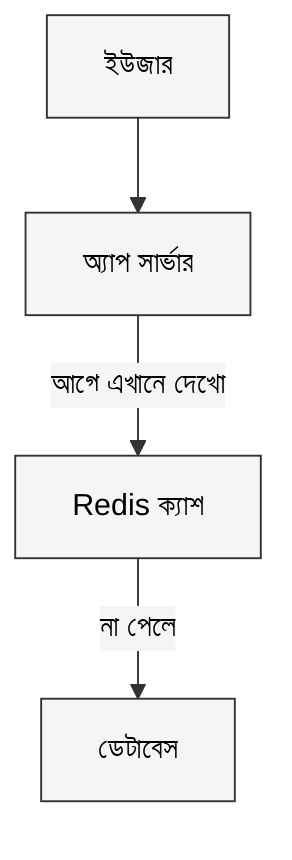

রেস্টুরেন্ট লিস্ট, মেনু: এসব বারবার পড়তে হয় কিন্তু কম বদলায়। সেগুলো ক্যাশে রাখো। ৮০-৯০% রিড ডেটাবেসে যাচ্ছেই না।

**সমস্যা কখন শুরু হয়:** একটাই অ্যাপ সার্ভার আর কুলাচ্ছে না।

---

### ধাপ ৪: একাধিক অ্যাপ সার্ভার (৫,০০,০০০ থেকে ২০ লাখ ইউজার)

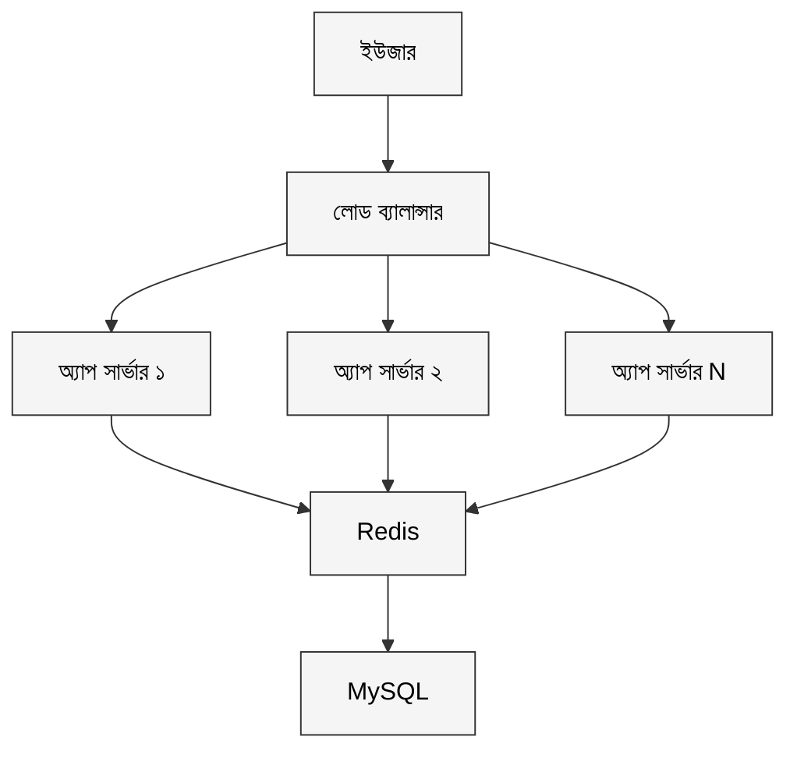

হরিজোন্টাল স্কেলিং শুরু হলো। লোড ব্যালান্সার সব সার্ভারে ভাগ করে দিচ্ছে। ট্র্যাফিক বাড়লে আরও সার্ভার যোগ করো।

**সমস্যা কখন শুরু হয়:** ডেটাবেসে এত বেশি কোয়েরি যাচ্ছে যে সে হাঁপাচ্ছে।

---

### ধাপ ৫: Read Replica যোগ করো (২০ লাখ থেকে ১ কোটি ইউজার)

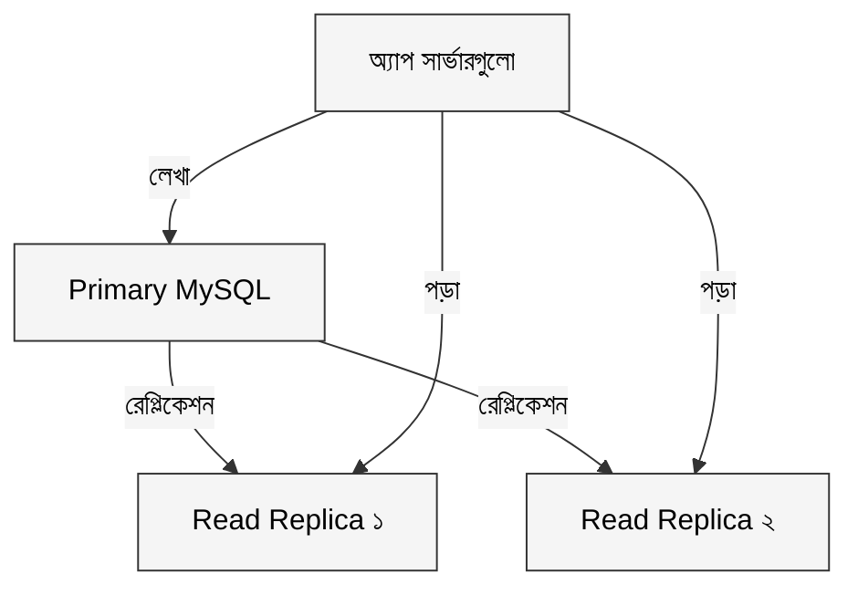

পড়া আর লেখা আলাদা হলো। ৯০% রিড এখন Replica সামলাচ্ছে।

**সমস্যা কখন শুরু হয়:** লেখার চাপ একটা Primary আর নিতে পারছে না।

---

### ধাপ ৬: Sharding (১ কোটির বেশি ইউজার)

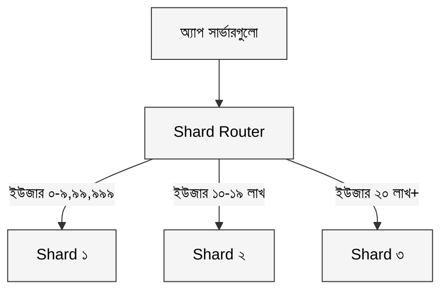

ডেটা ভাগ হয়ে গেল। প্রতিটা Shard ছোট, তাই দ্রুত। লেখা আর পড়া দুটোই স্কেল হচ্ছে।

**চ্যালেঞ্জ:** Shard করলে জটিলতা বাড়ে। দুই Shard জুড়ে কোয়েরি করা কঠিন। অনেক টিম এই পর্যায়ে CockroachDB বা Vitess এর মতো ডিস্ট্রিবিউটেড ডেটাবেসে চলে যায়।

---

## সারসংক্ষেপ

| গল্পের ভাষায় | প্রযুক্তির ভাষায় |
|---|---|
| বড় চুলা কেনা | Vertical Scaling |
| নতুন শাখা খোলা | Horizontal Scaling |
| দরজায় দারোয়ান যে ভাগ করে দেয় | Load Balancer |
| সার্ভার নিজে কিছু মনে রাখে না | Stateless Architecture |
| আদা আগেই ফুটিয়ে রাখা | Caching |
| টোকেন সিস্টেম | Message Queue |
| পড়ার জন্য আলাদা খাতা | Read Replica |
| ডেটা ভাগ করে রাখা | Sharding |

### মূল শিক্ষা

**Vertical Scaling সহজ, কিন্তু সীমিত।** শুরুতে ভালো, কিন্তু একটা সময় সবচেয়ে বড় মেশিনও ছোট লাগে।

**Horizontal Scaling জটিল, কিন্তু শক্তিশালী।** এটা করতে হলে সার্ভারকে Stateless বানাতে হবে।

**আগে বোতলনেক খোঁজো, তারপর স্কেল করো।** অ্যাপ সার্ভার বাড়িয়ে লাভ নেই যদি আসল সমস্যা ডেটাবেসে থাকে।

**ক্যাশিং, Replica, Sharding, Message Queue**: এই প্যাটার্নগুলো প্রায় সব বড় সিস্টেমেই দেখা যায়।

---

> স্কেলেবিলিটি শুধু লোড সামলানোর প্রশ্ন না: এটা হলো সিস্টেম না ভেঙে বড় হওয়ার শিল্প।
> পরবর্তী প্রশ্ন হলো: সিস্টেম স্কেল করলেই হলো? কিন্তু সেটা যদি প্রতিদিন ক্র্যাশ করে?
> সেই গল্পের নাম, **Availability।**

*System Design সিরিজের পরবর্তী পর্ব: Availability: সিস্টেম কখনো ঘুমায় না*
